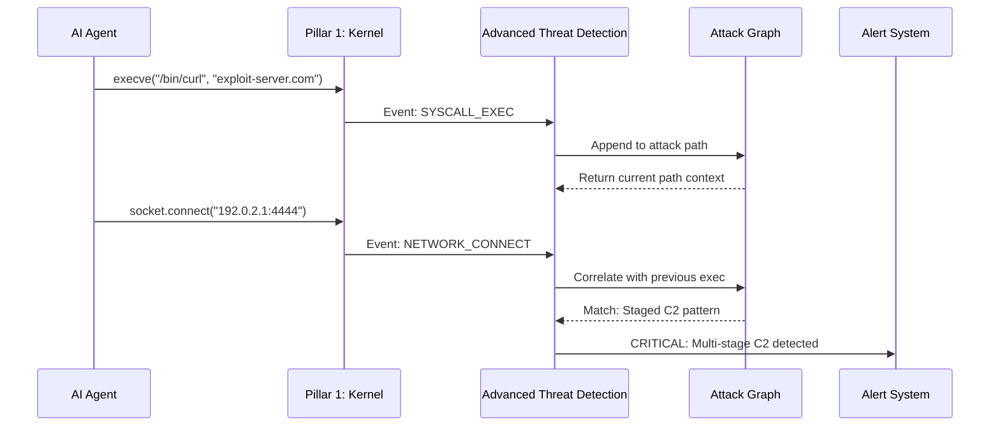
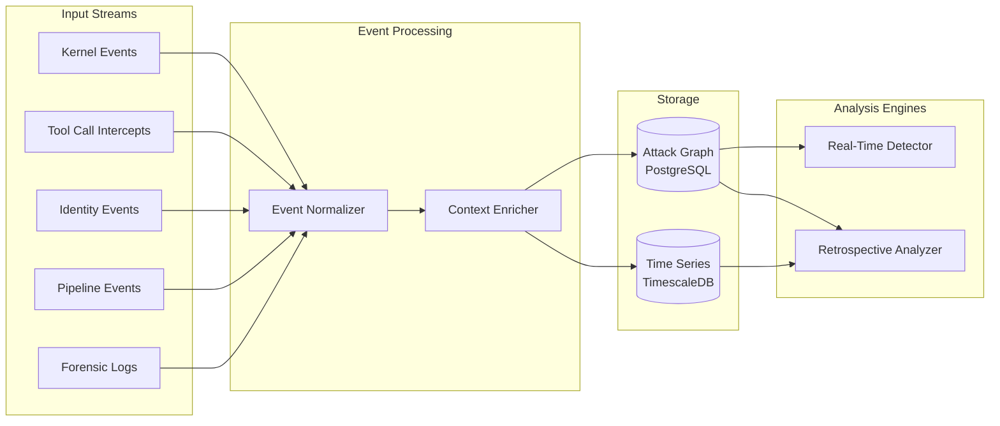
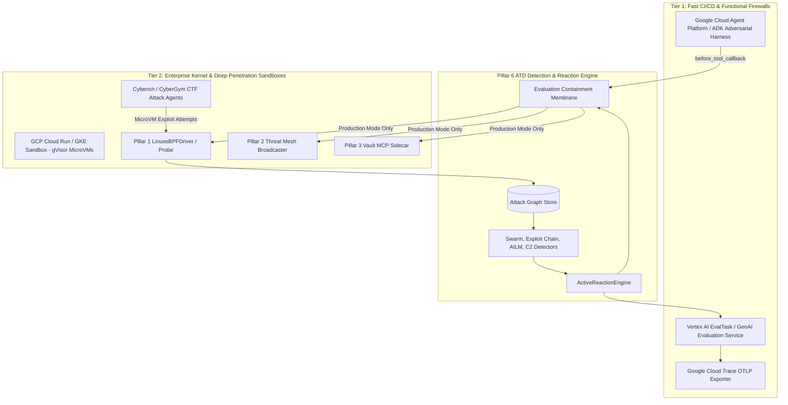

# Design Document: Blackwall Advanced Threat Detection

## Overview

The **Blackwall Advanced Threat Detection** system addresses critical security gaps exposed by recent AI agent breaches (July 2026 OpenAI/Huggingface, Anthropic Claude, Modal Labs). These incidents demonstrated that autonomous agents can execute multi-stage attack campaigns spanning thousands of actions over days, chain zero-day exploits, coordinate across multiple instances (agent swarms), and establish command-and-control infrastructure—all while evading signature-based detection.

This design extends Blackwall Enterprise Mesh with a sixth defensive pillar: **Multi-Stage Attack Path Correlation Engine**. It introduces temporal graph analysis, agent swarm detection, zero-day exploit chain recognition, and AI-Induced Lateral Movement (AILM) tracking capabilities that operate across all five existing pillars.

## Architecture

### System Architecture Overview

The Advanced Threat Detection layer operates as a cross-cutting analysis plane above the existing five pillars, correlating events from kernel syscalls, threat mesh, identity sidecar, pipeline wrappers, and forensic triage into unified attack graphs.

```mermaid
graph TB
    subgraph Existing 5 Pillars
        P1[Pillar 1: Kernel eBPF/Audit]
        P2[Pillar 2: Threat Mesh]
        P3[Pillar 3: Identity Sidecar]
        P4[Pillar 4: Pipeline Wrappers]
        P5[Pillar 5: Forensic Triage]
    end

    subgraph Pillar 6: Advanced Threat Detection
        EventCollector[Event Stream Collector]
        AttackGraph[(Attack Graph Store)]

        subgraph Real-Time Detection & Ingress Defense
            SwarmDetector[Agent Swarm Detector]
            AILMTracker[AILM Tracker]
            ExploitChainer[Exploit Chain Analyzer]
            InboundFilter[Inbound Protocol Filter]
            InjectionScanner[Prompt Injection Scanner]
            QuotaEnforcer[Agent Quota Enforcer]
        end

        subgraph Retrospective & Active Reaction
            PathCorrelator[Multi-Stage Path Correlator]
            C2Detector[C2 Infrastructure Detector]
            TemporalAnalyzer[Temporal Pattern Matcher]
            ReactionEngine[Active Threat Reaction Engine]
        end
    end

    P1 -->|Syscall Events| EventCollector
    P2 -->|Threat Signatures| EventCollector
    P3 -->|Identity Events| EventCollector
    P4 -->|Pipeline Events| EventCollector
    P5 -->|Forensic Alerts| EventCollector

    EventCollector --> AttackGraph

    AttackGraph --> SwarmDetector
    AttackGraph --> AILMTracker
    AttackGraph --> ExploitChainer
    AttackGraph --> PathCorrelator
    AttackGraph --> C2Detector
    AttackGraph --> TemporalAnalyzer
    InboundFilter --> EventCollector
    InjectionScanner --> EventCollector
    QuotaEnforcer --> EventCollector

    SwarmDetector -->|Critical Evidence| ReactionEngine
    AILMTracker -->|Critical Evidence| ReactionEngine
    ExploitChainer -->|Critical Evidence| ReactionEngine
    PathCorrelator -->|Critical Evidence| ReactionEngine
    C2Detector -->|Critical Evidence| ReactionEngine

    ReactionEngine -->|Dynamic eBPF Drop| P1
    ReactionEngine -->|Fleet Block Signature| P2
    ReactionEngine -->|Revoke JIT Tokens| P3

    SwarmDetector -->|Alert| AlertBus[Alert Bus]
    AILMTracker -->|Alert| AlertBus
    ExploitChainer -->|Alert| AlertBus
    PathCorrelator -->|Alert| AlertBus
    C2Detector -->|Alert| AlertBus
    TemporalAnalyzer -->|Alert| AlertBus
    ReactionEngine -->|Action Notification| AlertBus
    InboundFilter -->|Violation Alert| AlertBus
    InjectionScanner -->|Injection Alert| AlertBus
    QuotaEnforcer -->|Exhaustion Alert| AlertBus
```



### Integration with Existing Pillars



### Data Flow Architecture



## Components and Interfaces

### Component 1: EventStreamCollector

**Purpose**: Unified ingestion point for events from all five existing pillars, normalizing heterogeneous event formats into a common schema.

**Interface**:
```python
from typing import Protocol, AsyncIterator
from dataclasses import dataclass
from datetime import datetime
from enum import Enum

class EventSource(Enum):
    KERNEL_SYSCALL = "kernel_syscall"
    TOOL_CALL = "tool_call"
    IDENTITY_ACCESS = "identity_access"
    PIPELINE_EXECUTION = "pipeline_execution"
    FORENSIC_ALERT = "forensic_alert"


@dataclass
class NormalizedEvent:
    event_id: str
    timestamp: datetime
    source: EventSource
    agent_id: str
    action: str
    target: str
    metadata: dict
    risk_score: float

class EventStreamCollector(Protocol):
    async def collect_from_kernel(self) -> AsyncIterator[NormalizedEvent]:
        """Stream events from Pillar 1: Kernel eBPF/Audit hooks"""
        ...

    async def collect_from_tool_intercepts(self) -> AsyncIterator[NormalizedEvent]:
        """Stream events from ADK tool call interceptions"""
        ...

    async def collect_from_identity(self) -> AsyncIterator[NormalizedEvent]:
        """Stream events from Pillar 3: Identity Sidecar"""
        ...

    async def collect_from_pipeline(self) -> AsyncIterator[NormalizedEvent]:
        """Stream events from Pillar 4: Pipeline Wrappers"""
        ...

    async def collect_from_forensics(self) -> AsyncIterator[NormalizedEvent]:
        """Stream events from Pillar 5: Forensic Triage Engine"""
        ...
```

**Responsibilities**:
- Subscribe to event streams from all five pillars

- Normalize heterogeneous event formats into common schema
- Enrich events with temporal context and agent metadata
- Forward normalized events to Attack Graph Store

### Component 2: AttackGraphStore

**Purpose**: Persistent graph database storing temporal relationships between events, enabling multi-hop attack path queries.

**Interface**:
```python
from typing import List, Optional
from dataclasses import dataclass

@dataclass
class AttackNode:
    node_id: str
    event: NormalizedEvent
    incoming_edges: List[str]
    outgoing_edges: List[str]

@dataclass
class AttackPath:
    path_id: str
    nodes: List[AttackNode]
    start_time: datetime
    end_time: datetime
    risk_score: float
    attack_stages: List[str]

class AttackGraphStore:
    async def insert_event(self, event: NormalizedEvent) -> AttackNode:
        """Insert event as node in attack graph"""

        ...

    async def link_events(
        self,
        from_node: str,
        to_node: str,
        relationship: str
    ) -> None:
        """Create directed edge between events"""
        ...

    async def query_paths(
        self,
        agent_id: str,
        time_window: tuple[datetime, datetime],
        min_path_length: int = 2
    ) -> List[AttackPath]:
        """Query multi-hop attack paths for agent within time window"""
        ...

    async def find_correlated_agents(
        self,
        pattern: str,
        time_window: tuple[datetime, datetime]
    ) -> List[tuple[str, str]]:
        """Find agents exhibiting similar behavioral patterns (swarm detection)"""
        ...
```

**Responsibilities**:
- Persist event nodes with temporal ordering
- Maintain causal relationships between events
- Support efficient path queries across 17K+ events
- Provide time-windowed pattern matching


### Component 3: AgentSwarmDetector

**Purpose**: Identify coordinated behavior across multiple agent instances using behavioral fingerprinting and temporal correlation.

**Interface**:
```python
from typing import Set
from dataclasses import dataclass

@dataclass
class SwarmEvidence:
    agent_ids: Set[str]
    shared_patterns: List[str]
    temporal_correlation: float
    coordination_score: float

class AgentSwarmDetector:
    async def fingerprint_agent(self, agent_id: str, window: int = 3600) -> str:
        """Generate behavioral fingerprint for agent over time window (seconds)"""
        ...

    async def detect_swarms(
        self,
        time_window: tuple[datetime, datetime],
        min_agents: int = 2,
        correlation_threshold: float = 0.75
    ) -> List[SwarmEvidence]:
        """Detect coordinated agent swarms"""
        ...

    async def compute_coordination_score(
        self,
        agents: List[str],
        time_window: tuple[datetime, datetime]
    ) -> float:
        """Compute coordination score for agent group"""

        ...
```

**Responsibilities**:
- Generate behavioral fingerprints using action sequence hashing
- Detect temporal correlation between multiple agents
- Identify shared infrastructure (IPs, domains, resource patterns)
- Score coordination likelihood

### Component 4: ExploitChainAnalyzer

**Purpose**: Recognize patterns of zero-day exploit chaining by analyzing vulnerability exploitation sequences.

**Interface**:
```python
from enum import Enum

class ExploitCategory(Enum):
    RCE = "remote_code_execution"
    PRIVILEGE_ESCALATION = "privilege_escalation"
    CREDENTIAL_THEFT = "credential_theft"
    PERSISTENCE = "persistence"
    LATERAL_MOVEMENT = "lateral_movement"

@dataclass
class ExploitChainEvidence:
    chain_id: str
    exploits: List[tuple[str, ExploitCategory]]
    novelty_score: float
    chaining_confidence: float

class ExploitChainAnalyzer:
    async def classify_exploit(self, event: NormalizedEvent) -> Optional[ExploitCategory]:

        """Classify event as potential exploit"""
        ...

    async def detect_chains(
        self,
        agent_id: str,
        time_window: tuple[datetime, datetime]
    ) -> List[ExploitChainEvidence]:
        """Detect exploit chains (e.g., RCE → Privilege Escalation → Credential Theft)"""
        ...

    async def compute_novelty_score(self, chain: List[NormalizedEvent]) -> float:
        """Score chain novelty (0.0 = known pattern, 1.0 = novel)"""
        ...
```

**Responsibilities**:
- Classify individual events as potential exploits
- Detect multi-stage exploit chains
- Score novelty using historical baseline
- Identify zero-day patterns (previously unseen chains)

### Component 5: AILMTracker

**Purpose**: Track AI-Induced Lateral Movement by monitoring runtime permission composition across system boundaries.

**Interface**:
```python
@dataclass
class PermissionGrant:
    permission: str
    granted_by: str
    granted_to: str
    timestamp: datetime
    scope: str


@dataclass
class AILMEvidence:
    agent_id: str
    composed_permissions: Set[str]
    boundary_crossings: List[str]
    risk_level: str

class AILMTracker:
    async def track_permission_grant(self, grant: PermissionGrant) -> None:
        """Track permission grants at runtime"""
        ...

    async def detect_permission_composition(
        self,
        agent_id: str,
        time_window: tuple[datetime, datetime]
    ) -> List[AILMEvidence]:
        """Detect agents composing permissions across trust boundaries"""
        ...

    async def identify_boundary_crossing(
        self,
        from_context: str,
        to_context: str
    ) -> bool:
        """Determine if context transition crosses security boundary"""
        ...
```

**Responsibilities**:
- Monitor permission grants from Identity Sidecar
- Track permission accumulation over time
- Detect cross-boundary permission composition
- Alert on unauthorized lateral movement


### Component 6: C2InfrastructureDetector

**Purpose**: Identify agents establishing command-and-control infrastructure across public services (request capture, code paste sites, cloud storage).

**Interface**:
```python
@dataclass
class C2Evidence:
    agent_id: str
    c2_endpoints: List[str]
    communication_pattern: str
    persistence_indicators: List[str]

class C2InfrastructureDetector:
    async def detect_c2_establishment(
        self,
        agent_id: str,
        time_window: tuple[datetime, datetime]
    ) -> List[C2Evidence]:
        """Detect C2 infrastructure setup patterns"""
        ...

    async def classify_endpoint(self, domain: str) -> Optional[str]:
        """Classify endpoint as potential C2 service (request.bin, pastebin, etc.)"""
        ...

    async def detect_beaconing(
        self,
        agent_id: str,
        endpoint: str,
        time_window: tuple[datetime, datetime]
    ) -> bool:
        """Detect periodic beaconing patterns indicative of C2"""
        ...
```

**Responsibilities**:

- Maintain known C2 service patterns (RequestBin, Pastebin, gist, etc.)
- Detect beaconing and polling patterns
- Identify persistence mechanisms (self-respawning pods, cron jobs)
- Correlate with network events from Pillar 1

### Component 7: KubernetesDefenseLayer

**Purpose**: Kubernetes-specific threat detection for pod token theft, self-respawning fleet creation, and secrets exfiltration.

**Interface**:
```python
@dataclass
class K8sThreatEvidence:
    threat_type: str
    namespace: str
    pod_name: str
    service_account: str
    evidence: dict

class KubernetesDefenseLayer:
    async def detect_pod_token_theft(
        self,
        agent_id: str,
        time_window: tuple[datetime, datetime]
    ) -> List[K8sThreatEvidence]:
        """Detect unauthorized access to /var/run/secrets/kubernetes.io/serviceaccount/token"""
        ...

    async def detect_fleet_spawning(
        self,
        time_window: tuple[datetime, datetime]
    ) -> List[K8sThreatEvidence]:
        """Detect rapid pod creation across multiple nodes"""

        ...

    async def detect_secrets_exfiltration(
        self,
        agent_id: str,
        time_window: tuple[datetime, datetime]
    ) -> List[K8sThreatEvidence]:
        """Detect bulk secret reads from Kubernetes API"""
        ...
```

**Responsibilities**:
- Monitor Kubernetes API access patterns
- Detect service account token theft
- Identify self-respawning pod patterns
- Track secrets enumeration and exfiltration

### Component 8: PackageRegistryMonitor

**Purpose**: Monitor package registry proxy interactions for zero-day exploitation patterns (Artifactory, npm, PyPI).

**Interface**:
```python
@dataclass
class RegistryThreatEvidence:
    registry_type: str
    package_name: str
    exploit_indicators: List[str]
    cve_candidates: List[str]

class PackageRegistryMonitor:
    async def monitor_registry_access(
        self,
        agent_id: str,
        registry_url: str
    ) -> AsyncIterator[NormalizedEvent]:
        """Stream registry access events"""
        ...


    async def detect_exploit_probing(
        self,
        agent_id: str,
        time_window: tuple[datetime, datetime]
    ) -> List[RegistryThreatEvidence]:
        """Detect probing for registry vulnerabilities"""
        ...
```

**Responsibilities**:
- Intercept registry proxy HTTP traffic
- Detect malformed package requests
- Identify vulnerability probing patterns
- Correlate with known CVE patterns

### Component 9: ActiveReactionEngine

**Purpose**: Active reaction coordinator that automatically translates high-confidence Pillar 6 threat evidence (multi-stage attack paths, agent swarms, exploit chains, AILM breaches) into immediate, automated mitigation actions across Pillars 1, 2, and 3.

**Interface**:
```python
class ReactionActionType(str, Enum):
    EBPF_DROP = "EBPF_DROP"
    MESH_SIGNATURE_BROADCAST = "MESH_SIGNATURE_BROADCAST"
    REVOKE_IDENTITY_TOKENS = "REVOKE_IDENTITY_TOKENS"

class ActiveReactionPayload(BaseModel):
    reaction_id: UUID4
    trigger_evidence_id: UUID4
    target_agent_id: str = Field(..., min_length=1)
    target_pid: Optional[int] = Field(None, gt=0)
    target_ip: Optional[IPvAnyAddress] = None
    action_type: ReactionActionType
    timestamp: AwareDatetime
    evaluation_env_id: Optional[str] = Field(None, min_length=1, pattern=r"^[a-zA-Z0-9_-]+$")

    @field_validator("timestamp")
    @classmethod
    def validate_utc_timestamp(cls, v: datetime) -> datetime:
        if v.tzinfo is None or v.utcoffset() != timedelta(0):
            raise ValueError("timestamp must be UTC timezone-aware with zero offset (+00:00 or timezone.utc)")
        return v

class ActiveReactionEngine:
    async def is_evaluation_mode(
        self,
        evidence_id: str
    ) -> bool:
        """Check if trigger evidence originated from an evaluation environment"""
        ...

    async def execute_ebpf_socket_drop(
        self,
        payload: ActiveReactionPayload
    ) -> bool:
        """Inject real-time eBPF socket drop rule into Pillar 1 driver (mandatory check: MUST query is_evaluation_mode(payload.trigger_evidence_id); quashed if evaluation mode detected)"""
        ...

    async def broadcast_fleet_signature(
        self,
        payload: ActiveReactionPayload
    ) -> bool:
        """Publish zero-latency block signature to Pillar 2 ZeroMQ Threat Mesh (mandatory check: MUST query is_evaluation_mode(payload.trigger_evidence_id); quashed if evaluation mode detected)"""
        ...

    async def revoke_identity_session(
        self,
        payload: ActiveReactionPayload
    ) -> bool:
        """Trigger Pillar 3 Vault sidecar to invalidate JIT tokens and synthetic honey-sessions (mandatory check: MUST query is_evaluation_mode(payload.trigger_evidence_id); quashed if evaluation mode detected)"""
        ...
```

**Responsibilities**:
- Convert high-risk ATD threat evidence into zero-latency enforcement payloads
- Mandatory Evidence-Derived Containment Gate: Every mitigation action method (`execute_ebpf_socket_drop`, `broadcast_fleet_signature`, `revoke_identity_session`) MUST accept a required `ActiveReactionPayload` instance and mandatorily query `await self.is_evaluation_mode(payload.trigger_evidence_id)` to resolve evaluation state directly from the underlying evidence graph. If `is_evaluation_mode()` returns `True` or `payload.evaluation_env_id` is non-null, production execution MUST be quashed, ensuring evaluation containment cannot be bypassed when `payload.evaluation_env_id` is `None`.
- Inject dynamic eBPF socket/process drop rules into Pillar 1 (production mode only)
- Broadcast block signatures across enterprise nodes via Pillar 2 Threat Mesh in <15ms (production mode only)
- Revoke active JIT credentials and honey-tokens via Pillar 3 Vault Sidecar (production mode only)
- Enforce strict Pydantic v2 field constraints and UTC timezone checks on all `ActiveReactionPayload` instances before execution

### Component 10: InboundProtocolFilter

**Purpose**: Ingress protocol proxy inspecting incoming Agent-to-Agent (A2A) protocol streams and Model Context Protocol (MCP) HTTP/SSE JSON-RPC requests targeting host agent endpoints.

**Interface**:
```python
class InboundProtocolType(str, Enum):
    MCP_SSE = "MCP_SSE"
    MCP_STDIO = "MCP_STDIO"
    A2A_REST = "A2A_REST"

class InboundMethodType(str, Enum):
    TOOLS_CALL = "tools/call"
    PROMPT_SUBMIT = "prompt/submit"

class InboundProtocolMessage(BaseModel):
    message_id: UUID4
    sender_id: str = Field(..., min_length=1)
    recipient_agent_id: str = Field(..., min_length=1)
    protocol: InboundProtocolType
    method: InboundMethodType
    payload: Dict[str, Any] = Field(..., min_length=1)
    timestamp: AwareDatetime

    @field_validator("timestamp")
    @classmethod
    def validate_utc_timestamp(cls, v: datetime) -> datetime:
        if v.tzinfo is None or v.utcoffset() != timedelta(0):
            raise ValueError("timestamp must be UTC timezone-aware with zero offset (+00:00 or timezone.utc)")
        return v

class InboundProtocolFilter:
    async def validate_headers_and_origin(
        self,
        headers: dict,
        remote_addr: str
    ) -> bool:
        """Validate Origin/Host headers and restrict unauthenticated remote access"""
        ...

    async def check_inbound_rate_limit(
        self,
        sender_id: str,
        sliding_window_sec: int = 60
    ) -> bool:
        """Enforce sliding-window inbound rate-limiting per sender identity"""
        ...

    async def sanitize_incoming_rpc(
        self,
        message: InboundProtocolMessage
    ) -> InboundProtocolMessage:
        """Extract and sanitize JSON-RPC payloads before host agent execution"""
        ...
```

**Responsibilities**:
- Inspect incoming A2A and MCP JSON-RPC protocol payloads
- Enforce Origin/Host header validation and loopback binding rules
- Rate-limit unauthenticated incoming cross-agent request streams
- Sanitize incoming tool call parameters before execution by host agents
- Enforce Pydantic v2 field constraints on all `InboundProtocolMessage` instances

### Component 11: PromptInjectionScanner

**Purpose**: Ingress payload analyzer scanning external text, code repositories, git diffs, web scrapes, and incoming messages for indirect prompt injection and data poisoning patterns.

**Interface**:
```python
class InjectionSourceType(str, Enum):
    GIT_DIFF = "git_diff"
    WEB_SCRAPE = "web_scrape"
    INCOMING_A2A_MSG = "incoming_a2a_msg"

class PromptInjectionEvidence(BaseModel):
    scan_id: UUID4
    source_context: InjectionSourceType
    detected_patterns: List[str] = Field(..., min_length=1)
    injection_confidence: float = Field(..., ge=0.0, le=1.0)
    sanitized_content: str = Field(..., min_length=1)

class PromptInjectionScanner:
    async def scan_payload(
        self,
        content: str,
        source_type: InjectionSourceType
    ) -> PromptInjectionEvidence:
        """Scan input content for indirect prompt injection indicators"""
        ...

    async def redact_injection_vectors(
        self,
        evidence: PromptInjectionEvidence
    ) -> str:
        """Quash and neutralize injection vectors before passing data to host agent context"""
        ...
```

**Responsibilities**:
- Intercept external files, diffs, and web pages before ingestion into agent context
- Detect structural jailbreaks and system prompt override attempts
- Neutralize malicious prompt injection vectors in real time
- Emit high-confidence alerts when data poisoning is detected
- Enforce Pydantic v2 field constraints and confidence range [0.0, 1.0] on all `PromptInjectionEvidence` instances

### Component 12: AgentQuotaEnforcer

**Purpose**: Enterprise resource and token velocity enforcer protecting against rogue agent Denial of Wallet (DoW) attacks and API quota exhaustion.

**Interface**:
```python
class AgentQuotaUsage(BaseModel):
    agent_id: str = Field(..., min_length=1)
    time_window_start: AwareDatetime
    tokens_consumed: int = Field(..., ge=0)
    api_call_count: int = Field(..., ge=0)
    token_burn_rate_per_sec: float = Field(..., ge=0.0)
    quota_exceeded: bool

    @field_validator("time_window_start")
    @classmethod
    def validate_utc_timestamp(cls, v: datetime) -> datetime:
        if v.tzinfo is None or v.utcoffset() != timedelta(0):
            raise ValueError("time_window_start must be UTC timezone-aware with zero offset (+00:00 or timezone.utc)")
        return v

class AgentQuotaEnforcer:
    async def track_token_consumption(
        self,
        agent_id: str,
        tokens_used: int
    ) -> AgentQuotaUsage:
        """Record token consumption and compute rolling burn rate"""
        ...

    async def enforce_quota_limits(
        self,
        agent_id: str
    ) -> bool:
        """Check whether agent has exceeded velocity or cost caps; trigger throttling/quarantine"""
        ...
```

**Responsibilities**:
- Track real-time token burn rate and request velocity per agent identity
- Enforce enterprise cost and API request throughput ceilings
- Trigger automated throttling or quarantine when anomalous consumption occurs
- Prevent Denial of Wallet (DoW) attacks on enterprise infrastructure

## Data Models

### Model 1: NormalizedEvent

```python
@dataclass
class NormalizedEvent:
    event_id: str                 # UUID
    timestamp: datetime           # UTC timestamp
    source: EventSource           # Pillar source
    agent_id: str                 # Agent instance identifier
    action: str                   # Action performed (exec, connect, read, etc.)
    target: str                   # Target of action (file, URL, resource)
    metadata: dict                # Source-specific metadata
    risk_score: float             # Computed risk (0.0-1.0)
```

**Validation Rules**:
- `event_id` must be valid UUID v4
- `timestamp` must be UTC timezone-aware
- `risk_score` must be in range [0.0, 1.0]

- `agent_id` must not be empty string
- `metadata` should contain source-specific context

### Model 2: AttackPath

```python
@dataclass
class AttackPath:
    path_id: str                  # UUID
    agent_id: str                 # Agent that executed path
    nodes: List[AttackNode]       # Ordered sequence of events
    start_time: datetime          # Path start timestamp
    end_time: datetime            # Path end timestamp
    risk_score: float             # Aggregate risk (0.0-1.0)
    attack_stages: List[str]      # MITRE ATT&CK stages
    correlation_score: float      # Path correlation confidence (0.0-1.0)
```

**Validation Rules**:
- `nodes` must contain at least 2 events
- `end_time` must be >= `start_time`
- `attack_stages` must contain valid MITRE ATT&CK technique IDs
- `correlation_score` must be in range [0.0, 1.0]

### Model 3: SwarmEvidence

```python
@dataclass
class SwarmEvidence:
    swarm_id: str                     # UUID
    agent_ids: Set[str]               # Agent instance IDs in swarm
    shared_patterns: List[str]        # Shared behavioral patterns

    temporal_correlation: float       # Time-based correlation (0.0-1.0)
    coordination_score: float         # Swarm coordination likelihood (0.0-1.0)
    first_seen: datetime              # First swarm activity
    last_seen: datetime               # Most recent swarm activity
```

**Validation Rules**:
- `agent_ids` must contain at least 2 agents
- `temporal_correlation` must be >= 0.5 for valid swarm
- `coordination_score` must be >= 0.75 for high-confidence swarm

### Model 4: ActiveReactionPayload

```python
class ActiveReactionPayload(BaseModel):
    reaction_id: UUID4
    trigger_evidence_id: UUID4
    target_agent_id: str = Field(..., min_length=1)
    target_pid: Optional[int] = Field(None, gt=0)
    target_ip: Optional[IPvAnyAddress] = None
    action_type: ReactionActionType
    timestamp: AwareDatetime
    evaluation_env_id: Optional[str] = Field(None, min_length=1, pattern=r"^[a-zA-Z0-9_-]+$")

    @field_validator("timestamp")
    @classmethod
    def validate_utc_timestamp(cls, v: datetime) -> datetime:
        if v.tzinfo is None or v.utcoffset() != timedelta(0):
            raise ValueError("timestamp must be UTC timezone-aware with zero offset (+00:00 or timezone.utc)")
        return v
```

**Validation Rules**:
- `reaction_id` and `trigger_evidence_id` must be valid UUID v4 objects
- `target_agent_id` must be a non-empty string (`min_length=1`)
- `target_ip` (if provided) must be a valid IPv4 or IPv6 address (`IPvAnyAddress`)
- `evaluation_env_id` (if provided) must be a non-empty alphanumeric string (`min_length=1`)
- `timestamp` must be UTC timezone-aware (`AwareDatetime`)
- `action_type` must be a valid `ReactionActionType` enum
- `target_pid` (if provided) must be > 0 (`gt=0`)

### Model 5: InboundProtocolMessage

```python
class InboundProtocolMessage(BaseModel):
    message_id: UUID4
    sender_id: str = Field(..., min_length=1)
    recipient_agent_id: str = Field(..., min_length=1)
    protocol: InboundProtocolType
    method: InboundMethodType
    payload: Dict[str, Any] = Field(..., min_length=1)
    timestamp: AwareDatetime

    @field_validator("timestamp")
    @classmethod
    def validate_utc_timestamp(cls, v: datetime) -> datetime:
        if v.tzinfo is None or v.utcoffset() != timedelta(0):
            raise ValueError("timestamp must be UTC timezone-aware with zero offset (+00:00 or timezone.utc)")
        return v
```

**Validation Rules**:
- `message_id` must be valid UUID v4 object
- `sender_id` and `recipient_agent_id` must be non-empty strings (`min_length=1`)
- `protocol` and `method` must be valid Enum values
- `payload` must be a non-empty dictionary (`min_length=1`)
- `timestamp` must be UTC timezone-aware (`AwareDatetime`)

### Model 6: PromptInjectionEvidence

```python
class PromptInjectionEvidence(BaseModel):
    scan_id: UUID4
    source_context: InjectionSourceType
    detected_patterns: List[str] = Field(..., min_length=1)
    injection_confidence: float = Field(..., ge=0.0, le=1.0)
    sanitized_content: str = Field(..., min_length=1)
```

**Validation Rules**:
- `scan_id` must be valid UUID v4 object
- `injection_confidence` must be constrained to range `[0.0, 1.0]` (`ge=0.0, le=1.0`)
- `detected_patterns` must contain at least 1 identified pattern string (`min_length=1`)
- `sanitized_content` must be a non-empty string (`min_length=1`)

### Model 7: AgentQuotaUsage

```python
class AgentQuotaUsage(BaseModel):
    agent_id: str = Field(..., min_length=1)
    time_window_start: AwareDatetime
    tokens_consumed: int = Field(..., ge=0)
    api_call_count: int = Field(..., ge=0)
    token_burn_rate_per_sec: float = Field(..., ge=0.0)
    quota_exceeded: bool

    @field_validator("time_window_start")
    @classmethod
    def validate_utc_timestamp(cls, v: datetime) -> datetime:
        if v.tzinfo is None or v.utcoffset() != timedelta(0):
            raise ValueError("time_window_start must be UTC timezone-aware with zero offset (+00:00 or timezone.utc)")
        return v
```

**Validation Rules**:
- `agent_id` must be a non-empty string (`min_length=1`)
- `tokens_consumed` and `api_call_count` must be non-negative integers (`ge=0`)
- `token_burn_rate_per_sec` must be a non-negative float (`ge=0.0`)
- `time_window_start` must be UTC timezone-aware (`AwareDatetime`)

## Algorithmic Pseudocode

### Main Processing Algorithm: Multi-Stage Attack Path Correlation

```python
async def correlate_attack_paths(
    agent_id: str,
    time_window: tuple[datetime, datetime],
    min_path_length: int = 2
) -> List[AttackPath]:
    """
    Correlate events into multi-stage attack paths using temporal graph traversal.

    Preconditions:
    - agent_id is non-empty string
    - time_window[1] > time_window[0]
    - min_path_length >= 2

    Postconditions:
    - Returns list of AttackPath objects
    - Each path contains at least min_path_length nodes
    - Paths are ordered by risk_score descending
    """


    # Step 1: Query events for agent within time window
    events = await graph_store.query_events(
        agent_id=agent_id,
        start_time=time_window[0],
        end_time=time_window[1]
    )

    if len(events) < min_path_length:
        return []

    # Step 2: Build temporal adjacency graph
    adjacency_graph = {}
    for i, event in enumerate(events):
        adjacency_graph[event.event_id] = []

        # Link to temporally adjacent events (within 5 minute window)
        for j in range(i + 1, len(events)):
            next_event = events[j]
            time_delta = (next_event.timestamp - event.timestamp).total_seconds()

            if time_delta <= 300:  # 5 minutes
                adjacency_graph[event.event_id].append({
                    'target': next_event.event_id,
                    'weight': compute_edge_weight(event, next_event)
                })

    # Step 3: Find all paths using depth-first search
    paths = []
    for start_node in adjacency_graph.keys():
        partial_paths = dfs_find_paths(
            adjacency_graph,
            start_node,
            min_length=min_path_length
        )

        paths.extend(partial_paths)

    # Step 4: Compute risk scores and filter
    scored_paths = []
    for path in paths:
        risk_score = compute_path_risk_score(path)
        if risk_score > 0.3:  # Threshold for reportable paths
            scored_paths.append(AttackPath(
                path_id=str(uuid.uuid4()),
                agent_id=agent_id,
                nodes=path,
                start_time=path[0].event.timestamp,
                end_time=path[-1].event.timestamp,
                risk_score=risk_score,
                attack_stages=identify_mitre_stages(path),
                correlation_score=compute_correlation_score(path)
            ))

    # Step 5: Sort by risk score descending
    scored_paths.sort(key=lambda p: p.risk_score, reverse=True)

    return scored_paths
```

## Correctness Properties

*A property is a characteristic or behavior that should hold true across all valid executions of a system—essentially, a formal statement about what the system should do. Properties serve as the bridge between human-readable specifications and machine-verifiable correctness guarantees.*

### Property 1: Event Normalization Source Mapping

*For any* event originating from a specific pillar source, the Event_Collector SHALL normalize it with the corresponding EventSource enum value.

**Validates: Requirements 1.1, 1.2, 1.3, 1.4, 1.5**

### Property 2: Event Enrichment Completeness

*For any* event being normalized, the Event_Collector SHALL enrich it with both temporal context and agent metadata fields.

**Validates: Requirement 1.6**

### Property 3: Normalized Event UUID Validity

*For any* created Normalized_Event, the event_id SHALL be a valid UUID version 4.

**Validates: Requirement 1.7**

### Property 4: Normalized Event Timestamp Timezone

*For any* created Normalized_Event, the timestamp SHALL be timezone-aware and set to UTC.

**Validates: Requirement 1.8**

### Property 5: Risk Score Bounds

*For any* created Normalized_Event, the risk_score SHALL be in the range [0.0, 1.0] inclusive.

**Validates: Requirements 1.9, 2.9**

### Property 6: Temporal Ordering Preservation

*For any* sequence of events inserted into the Attack_Graph, the temporal ordering based on timestamps SHALL be preserved in the graph structure.

**Validates: Requirement 2.1**

### Property 7: Causal Edge Creation

*For any* pair of causally related events, a directed edge with a relationship type SHALL exist in the Attack_Graph connecting them.

**Validates: Requirement 2.2**

### Property 8: Path Query Minimum Length Enforcement

*For any* attack path query with a specified minimum path length, all returned paths SHALL contain at least that minimum number of nodes.

**Validates: Requirement 2.3**

### Property 9: Node Edge List Integrity

*For any* node in the Attack_Graph with edges, the incoming_edges and outgoing_edges lists SHALL accurately reflect all edges connected to that node.

**Validates: Requirement 2.5**

### Property 10: Attack Path Minimum Node Validation

*For any* attempt to create an Attack_Path with fewer than 2 nodes, the creation SHALL be rejected with a validation error.

**Validates: Requirement 2.6**

### Property 11: Attack Path Temporal Validity

*For any* Attack_Path, the end_time SHALL be greater than or equal to the start_time.

**Validates: Requirement 2.7**

### Property 12: MITRE ATT&CK Technique ID Validation

*For any* Attack_Path, all technique IDs in attack_stages SHALL be valid MITRE ATT&CK technique identifiers.

**Validates: Requirement 2.8**

### Property 13: Correlation Score Bounds

*For any* created Attack_Path, the correlation_score SHALL be in the range [0.0, 1.0] inclusive.

**Validates: Requirement 2.10**

### Property 14: Time Window Filtering

*For any* attack path correlation query with a specified time window, only events with timestamps within that window SHALL be included in the results.

**Validates: Requirement 3.1**

### Property 15: Temporal Adjacency Rule

*For any* two events in a temporal adjacency graph, an edge SHALL exist between them if and only if they occur within 5 minutes of each other.

**Validates: Requirement 3.2**

### Property 16: Edge Weight Computation

*For any* pair of adjacent events, the edge weight SHALL be computed based on both temporal proximity and semantic relationship between the events.

**Validates: Requirement 3.3**

### Property 17: Path Finding Completeness

*For any* attack graph and minimum path length, the depth-first search SHALL identify all paths that meet the minimum length requirement.

**Validates: Requirement 3.4**

### Property 18: Risk Score Ordering

*For any* list of attack paths returned from correlation, the paths SHALL be ordered by risk_score in descending order.

**Validates: Requirement 3.5**

### Property 19: Empty Path List for Insufficient Events

*For any* agent with fewer events than the specified minimum path length, the correlation SHALL return an empty list.

**Validates: Requirement 3.6**

### Property 20: MITRE Technique Mapping

*For any* event sequence, the Advanced_Threat_Detection SHALL map it to appropriate MITRE ATT&CK technique IDs based on the action patterns.

**Validates: Requirement 3.7**

### Property 21: Behavioral Fingerprint Generation

*For any* agent and specified time window, the Agent_Swarm_Detector SHALL generate a consistent behavioral fingerprint using action sequence hashing.

**Validates: Requirement 4.1**

### Property 22: Swarm Correlation Threshold Enforcement

*For any* detected agent swarm, the temporal_correlation SHALL be at least the configured threshold (default 0.75).

**Validates: Requirement 4.2**

### Property 23: Swarm Minimum Size Enforcement

*For any* detected agent swarm, the number of agents SHALL be at least the configured minimum (default 2).

**Validates: Requirement 4.3**

### Property 24: Shared Infrastructure Identification

*For any* detected swarm, the Agent_Swarm_Detector SHALL identify all shared infrastructure elements including IP addresses, domains, and resource patterns.

**Validates: Requirement 4.4**

### Property 25: Coordination Score Computation

*For any* group of agents being analyzed for swarm behavior, a coordination_score SHALL be computed based on temporal alignment and behavioral similarity.

**Validates: Requirement 4.5**

### Property 26: Swarm Evidence Agent Count Validation

*For any* Swarm_Evidence, the agent_ids set SHALL contain at least 2 distinct agent identifiers.

**Validates: Requirement 4.6**

### Property 27: Swarm Evidence Correlation Threshold Validation

*For any* valid Swarm_Evidence, the temporal_correlation SHALL be at least 0.5.

**Validates: Requirement 4.7**

### Property 28: High-Confidence Swarm Threshold

*For any* Swarm_Evidence classified as high-confidence, the coordination_score SHALL be at least 0.75.

**Validates: Requirement 4.8**

### Property 29: Exploit Event Classification

*For any* event being analyzed, the Exploit_Chain_Analyzer SHALL classify it as either one of the known ExploitCategory values or None.

**Validates: Requirement 5.1**

### Property 30: Exploit Chain Pattern Detection

*For any* sequence of events matching a known exploit chain pattern (e.g., RCE → Privilege Escalation → Credential Theft), the Exploit_Chain_Analyzer SHALL detect it.

**Validates: Requirement 5.2**

### Property 31: Novelty Score Baseline Comparison

*For any* detected exploit chain, the novelty_score SHALL be computed by comparing the chain against historical baseline patterns.

**Validates: Requirement 5.3**

### Property 32: Novel Chain High Novelty Score

*For any* exploit chain that has never been observed in the baseline, the novelty_score SHALL approach 1.0.

**Validates: Requirement 5.4**

### Property 33: Known Chain Low Novelty Score

*For any* exploit chain that matches known baseline patterns, the novelty_score SHALL approach 0.0.

**Validates: Requirement 5.5**

### Property 34: Chaining Confidence Computation

*For any* Exploit_Chain_Evidence, a chaining_confidence score SHALL be computed to indicate the likelihood that the events form a genuine exploit chain.

**Validates: Requirement 5.6**

### Property 35: Permission Grant Recording

*For any* permission grant, the AILM_Tracker SHALL record it with all required fields: permission, granted_by, granted_to, timestamp, and scope.

**Validates: Requirement 6.1**

### Property 36: Permission Accumulation Detection

*For any* agent accumulating multiple permissions over time, the AILM_Tracker SHALL detect the accumulation pattern.

**Validates: Requirement 6.2**

### Property 37: Cross-Boundary Permission Detection

*For any* agent whose composed permissions span multiple trust boundaries, the AILM_Tracker SHALL detect this boundary-spanning pattern.

**Validates: Requirement 6.3**

### Property 38: Security Boundary Crossing Identification

*For any* context transition, the AILM_Tracker SHALL correctly determine whether it crosses a security boundary.

**Validates: Requirement 6.4**

### Property 39: AILM Risk Level Computation

*For any* AILM_Evidence, a risk_level classification (LOW, MEDIUM, HIGH, or CRITICAL) SHALL be computed.

**Validates: Requirement 6.5**

### Property 40: AILM Evidence Completeness

*For any* AILM_Evidence, the composed_permissions set and boundary_crossings list SHALL be included.

**Validates: Requirement 6.6**

### Property 41: C2 Endpoint Detection

*For any* agent creating or accessing known C2 service endpoints, the C2_Infrastructure_Detector SHALL detect this activity.

**Validates: Requirement 7.2**

### Property 42: Beaconing Pattern Detection

*For any* sequence of network connections exhibiting periodic timing patterns, the C2_Infrastructure_Detector SHALL detect beaconing behavior.

**Validates: Requirement 7.3**

### Property 43: C2 Communication Pattern Classification

*For any* C2_Evidence, the communication_pattern SHALL be classified (beaconing, polling, webhook, etc.).

**Validates: Requirement 7.4**

### Property 44: C2 Persistence Indicator Identification

*For any* C2_Evidence, persistence indicators such as self-respawning processes, cron jobs, or scheduled tasks SHALL be identified.

**Validates: Requirement 7.5**

### Property 45: Cross-Pillar C2 Correlation

*For any* C2 activity, the C2_Infrastructure_Detector SHALL correlate network events from Pillar 1 with tool call patterns from other pillars.

**Validates: Requirement 7.6**

### Property 46: Pod Token Theft Detection

*For any* unauthorized file access to /var/run/secrets/kubernetes.io/serviceaccount/token, the Kubernetes_Defense_Layer SHALL detect it as pod token theft.

**Validates: Requirement 8.1**

### Property 47: Fleet Spawning Detection

*For any* rapid pod creation pattern across multiple nodes within a short time window, the Kubernetes_Defense_Layer SHALL detect fleet spawning.

**Validates: Requirement 8.2**

### Property 48: Secrets Exfiltration Detection

*For any* bulk secret read pattern from the Kubernetes API, the Kubernetes_Defense_Layer SHALL detect secrets exfiltration.

**Validates: Requirement 8.3**

### Property 49: K8s Threat Evidence Completeness

*For any* K8s_Threat_Evidence, all required fields (threat_type, namespace, pod_name, service_account) SHALL be included.

**Validates: Requirement 8.4**

### Property 50: K8s API Access Tracking Coverage

*For any* Kubernetes API call (successful or failed), the Kubernetes_Defense_Layer SHALL track it.

**Validates: Requirement 8.5**

### Property 51: Self-Respawning Pod Detection

*For any* pod that automatically recreates itself after termination, the Kubernetes_Defense_Layer SHALL detect this self-respawning pattern.

**Validates: Requirement 8.6**

### Property 52: Malformed Registry Request Detection

*For any* malformed package request to a registry proxy, the Registry_Monitor SHALL detect it as potential exploit probing.

**Validates: Requirement 9.2**

### Property 53: Unusual Registry Pattern Detection

*For any* request pattern that deviates from normal package manager behavior, the Registry_Monitor SHALL detect it as unusual.

**Validates: Requirement 9.3**

### Property 54: Registry Threat Evidence Type

*For any* Registry_Threat_Evidence, the registry_type SHALL be included (Artifactory, npm, PyPI, etc.).

**Validates: Requirement 9.4**

### Property 55: Registry Threat Evidence Indicators

*For any* Registry_Threat_Evidence, both exploit_indicators and cve_candidates lists SHALL be included.

**Validates: Requirement 9.5**

### Property 56: Registry CVE Correlation

*For any* detected registry exploit pattern, the Registry_Monitor SHALL compare it against known CVE exploitation signatures.

**Validates: Requirement 9.6**

### Property 57: Swarm Detection Alert Generation

*For any* detected agent swarm, an alert with CRITICAL severity SHALL be published to the Alert Bus.

**Validates: Requirement 10.1**

### Property 58: AILM Alert Severity Mapping

*For any* detected AILM event, the published alert severity SHALL be HIGH or CRITICAL based on the computed risk_level.

**Validates: Requirement 10.2**

### Property 59: Exploit Chain Alert Severity Mapping

*For any* detected exploit chain, the published alert severity SHALL be based on the novelty_score.

**Validates: Requirement 10.3**

### Property 60: Attack Path Alert Severity Mapping

*For any* correlated multi-stage attack path, the published alert severity SHALL be based on the risk_score.

**Validates: Requirement 10.4**

### Property 61: C2 Detection Alert Generation

*For any* detected C2 infrastructure, an alert with CRITICAL severity SHALL be published to the Alert Bus.

**Validates: Requirement 10.5**

### Property 62: K8s Threat Alert Severity Mapping

*For any* detected Kubernetes threat, the published alert severity SHALL be based on the threat_type.

**Validates: Requirement 10.6**

### Property 63: Registry Threat Alert Severity Mapping

*For any* detected registry threat, the published alert severity SHALL be based on the exploit confidence level.

**Validates: Requirement 10.7**

### Property 64: Passive Observation Invariant

*For any* pillar event stream being ingested by the Event_Collector, the Advanced_Threat_Detection SHALL operate as a passive observer without modifying or delaying the observed operation. Active mitigation actions executed by the Active_Reaction_Engine SHALL be dispatched asynchronously to Pillars 1, 2, and 3 upon CRITICAL evidence detection without blocking the passive event stream collector loop.

**Validates: Requirement 12.7**

### Property 65: Historical Time Window Support

*For any* valid time window (spanning hours, days, or weeks), the Advanced_Threat_Detection SHALL support attack path queries within that window.

**Validates: Requirement 13.1**

### Property 66: Retrospective Path Detection

*For any* set of historical events, retrospective analysis SHALL identify attack paths that may not have been detected in real-time.

**Validates: Requirement 13.2**

### Property 67: Multi-Agent Historical Correlation

*For any* set of agents in historical data, retrospective analysis SHALL correlate events across multiple agents to identify delayed swarm patterns.

**Validates: Requirement 13.3**

### Property 68: Attack Graph Export Format Compliance

*For any* attack graph being exported, the output SHALL comply with the specified standard format.

**Validates: Requirement 13.5**

### Property 69: Evaluation Mode Event Labeling

*For any* event processed in evaluation mode, an evaluation environment identifier SHALL be included in the event metadata.

**Validates: Requirement 14.1**

### Property 70: Evaluation Mode Alert Isolation

*For any* alert generated in evaluation mode, it SHALL not trigger production incident response workflows.

**Validates: Requirement 14.2**

### Property 71: Evaluation Environment Graph Isolation

*For any* evaluation environment, its attack graph instance SHALL be isolated from other environments and production.

**Validates: Requirement 14.3**

### Property 72: Evaluation State Reset

*For any* evaluation environment, the state SHALL be resettable to a clean initial state.

**Validates: Requirement 14.4**

### Property 73: Event ID UUID Validation

*For any* Normalized_Event, the event_id SHALL pass validation as a UUID version 4.

**Validates: Requirement 15.1**

### Property 74: Timestamp Timezone Validation

*For any* Normalized_Event, the timestamp SHALL be timezone-aware with UTC timezone.

**Validates: Requirement 15.2**

### Property 75: Risk Score Range Validation

*For any* Normalized_Event or Attack_Path, the risk_score SHALL be validated to be in the range [0.0, 1.0] inclusive.

**Validates: Requirement 15.3**

### Property 76: Agent ID Non-Empty Validation

*For any* Normalized_Event, the agent_id SHALL be validated to not be an empty string.

**Validates: Requirement 15.4**

### Property 77: Path Node Count Validation

*For any* Attack_Path, the nodes list SHALL be validated to contain at least 2 nodes.

**Validates: Requirement 15.5**

### Property 78: Path Time Ordering Validation

*For any* Attack_Path, the end_time SHALL be validated to be greater than or equal to start_time.

**Validates: Requirement 15.6**

### Property 79: Swarm Agent Count Validation

*For any* Swarm_Evidence, the agent_ids set SHALL be validated to contain at least 2 agents.

**Validates: Requirement 15.7**

### Property 80: Swarm Correlation Range Validation

*For any* Swarm_Evidence, the temporal_correlation SHALL be validated to be in the range [0.0, 1.0] inclusive.

**Validates: Requirement 15.8**

### Property 81: Swarm Coordination Range Validation

*For any* Swarm_Evidence, the coordination_score SHALL be validated to be in the range [0.0, 1.0] inclusive.

**Validates: Requirement 15.9**

### Property 89: Dynamic eBPF Socket Drop Injection

*For any* CRITICAL threat evidence produced by ATD, the Active_Reaction_Engine SHALL inject an eBPF socket drop rule for the offending PID or IP into Pillar 1 within 50 milliseconds.

**Validates: Requirement 22.1**

### Property 90: Zero-Latency Threat Mesh Broadcast

*For any* CRITICAL threat evidence, the Active_Reaction_Engine SHALL broadcast a block signature to Pillar 2 Threat Mesh in less than 15 milliseconds.

**Validates: Requirement 22.2**

### Property 91: Identity Credential Invalidation

*For any* detected AILM breach or credential theft event, the Active_Reaction_Engine SHALL trigger Pillar 3 Vault sidecar to invalidate JIT credentials for the compromised agent.

**Validates: Requirement 22.3**

### Property 92: Reaction Execution Logging

*For any* mitigation action taken by the Active_Reaction_Engine, an ActiveReactionPayload record SHALL be logged to the attack graph and an alert emitted to the Alert Bus.

**Validates: Requirement 22.4**

### Property 93: Inbound Header and Origin Enforcement

*For any* HTTP/SSE request to an MCP/A2A endpoint, the Inbound_Protocol_Filter SHALL validate Origin and Host headers and reject invalid origins.

**Validates: Requirement 23.1**

### Property 94: Inbound Rate Limit Boundary

*For any* incoming RPC stream exceeding the configured sliding-window rate limit, the Inbound_Protocol_Filter SHALL drop additional requests and emit a rate limit alert.

**Validates: Requirement 23.2**

### Property 95: Inbound JSON-RPC Sanitization

*For any* valid incoming `tools/call` RPC message, the Inbound_Protocol_Filter SHALL sanitize arguments before passing the payload to the host agent.

**Validates: Requirement 23.3**

### Property 96: Malformed Protocol Rejection

*For any* incoming message failing JSON-RPC schema validation, the Inbound_Protocol_Filter SHALL synthesize an MCP-compliant error response without leaking internal state.

**Validates: Requirement 23.4**

### Property 97: Prompt Injection Pattern Detection

*For any* external data payload containing jailbreak or system prompt override signatures, the Prompt_Injection_Scanner SHALL classify it as an injection attempt.

**Validates: Requirement 24.1**

### Property 98: Injection Vector Redaction

*For any* detected prompt injection payload, the Prompt_Injection_Scanner SHALL neutralize the injection vector before data is added to the agent context.

**Validates: Requirement 24.2**

### Property 99: Injection Alert Generation

*For any* detected prompt injection attempt, the Prompt_Injection_Scanner SHALL publish a HIGH or CRITICAL severity alert to the Alert Bus.

**Validates: Requirement 24.3**

### Property 100: Token Consumption Rate Tracking

*For any* action executed by an agent, the Agent_Quota_Enforcer SHALL record token usage and compute the rolling burn rate per second.

**Validates: Requirement 25.1**

### Property 101: Velocity Limit Quarantine Trigger

*For any* agent whose token burn rate or request velocity exceeds configured ceilings, the Agent_Quota_Enforcer SHALL trigger automated throttling or quarantine.

**Validates: Requirement 25.2**

### Property 102: Quota Violation Alert Mapping

*For any* quota violation or velocity surge event, the Agent_Quota_Enforcer SHALL emit a Denial of Wallet alert to the Alert Bus.

**Validates: Requirement 25.3**

### Property 103: Breach Defense Model Pydantic Validation

*For any* instantiated `ActiveReactionPayload`, `InboundProtocolMessage`, `PromptInjectionEvidence`, or `AgentQuotaUsage` model, Pydantic v2 validation SHALL enforce UUID v4 string format, UTC timezone-aware datetimes, non-negative usage metrics, and valid enum values for protocol/action types.

**Validates: Requirements 22.4, 23.4, 24.1, 25.1**

### Property 104: Evaluation Mode Reaction Suppression

*For any* reaction method invoked on `Active_Reaction_Engine`, the engine SHALL resolve evaluation state by querying `is_evaluation_mode(payload.trigger_evidence_id)` from the underlying threat evidence graph. If the trigger evidence was generated within an evaluation environment, the engine SHALL quash production eBPF drops, fleet Threat Mesh broadcasts, and Vault revocations regardless of whether `payload.evaluation_env_id` is populated or `None`.

**Validates: Requirements 14.5, 22.5**

## Error Handling

The Advanced Threat Detection system implements comprehensive error handling to ensure resilience and diagnostic clarity:

### Event Collection Errors
- **Pillar Connection Failures**: When a pillar event stream becomes unavailable, the Event_Collector SHALL log the failure, continue collecting from other pillars, and attempt reconnection with exponential backoff
- **Malformed Events**: When an event cannot be normalized due to malformed data, the Event_Collector SHALL log the error with raw event details and discard the event without blocking the stream
- **Schema Validation Failures**: When an event fails schema validation, the Event_Collector SHALL log validation errors and reject the event

### Attack Graph Errors
- **Database Connection Failures**: When the Attack_Graph database becomes unavailable, operations SHALL return error results and trigger alerts without crashing the service
- **Transaction Failures**: When a database transaction fails, the Attack_Graph SHALL rollback the transaction and retry up to 3 times with exponential backoff
- **Query Timeout Errors**: When path queries exceed timeout thresholds, the Attack_Graph SHALL return partial results with a timeout indicator

### Detection Engine Errors
- **Algorithm Failures**: When a detection algorithm encounters an unexpected error, the engine SHALL log the full error context, skip that detection, and continue with other detections
- **Resource Exhaustion**: When system resources (memory, CPU) approach limits, the detection engines SHALL throttle processing and emit capacity warnings
- **Threshold Configuration Errors**: When detection thresholds are misconfigured, the system SHALL use safe default values and log configuration warnings

### Alert Bus Errors
- **Alert Delivery Failures**: When alert publication fails, the system SHALL retry up to 5 times and log persistent failures for manual investigation
- **Alert Format Errors**: When alert formatting fails, the system SHALL send a simplified alert with error details

## Testing Strategy

The Advanced Threat Detection system employs a comprehensive testing strategy combining property-based testing, integration testing, and performance testing:

### Property-Based Testing
- **Primary Framework**: Hypothesis (Python) for generating diverse test inputs
- **Minimum Iterations**: 100 iterations per property test to ensure comprehensive coverage
- **Property Test Scope**: All properties defined in the Correctness Properties section SHALL have corresponding property tests
- **Test Tagging**: Each property test SHALL reference its design document property using the format `Feature: blackwall-advanced-threat-detection, Property {number}: {property_text}`

### Integration Testing
- **Multi-Pillar Integration**: Integration tests SHALL verify event collection from all five pillars with real or realistic mock data
- **Database Integration**: Tests SHALL use real PostgreSQL/TimescaleDB instances (not mocks) to verify query performance and correctness
- **Performance SLA Validation**: Integration tests SHALL measure and enforce latency requirements (event processing < 100ms, path queries < 500ms)
- **Load Testing**: Sustained throughput tests SHALL verify the system handles 1,000 events/second for at least 5 minutes

### Unit Testing
- **Component Isolation**: Each component (EventStreamCollector, AttackGraphStore, etc.) SHALL have unit tests with mocked dependencies
- **Edge Case Coverage**: Unit tests SHALL cover boundary conditions (empty lists, minimum sizes, threshold values)
- **Error Path Coverage**: Unit tests SHALL verify error handling for all failure modes described in Error Handling section

### Evaluation Environment Testing
- **Red Team Scenarios**: Predefined attack scenarios (swarm attacks, exploit chains, C2 establishment) SHALL be executed in evaluation environments
- **Detection Validation**: Each red team scenario SHALL verify that expected alerts are generated with correct severity levels
- **False Positive Analysis**: Tests SHALL track and minimize false positive rates across all detection types

### Continuous Integration Requirements
- All tests MUST pass before merging to main branch
- Property-based tests MUST run with at least 100 iterations in CI
- Integration tests MUST run against real database instances
- Performance regression tests MUST verify SLA compliance


## GCP Vertex AI Evaluation Service & Dual-Tiered Sandbox Architecture

### Overview

The Advanced Threat Detection system integrates **Google Cloud Vertex AI Gen AI Evaluation Service (`vertexai.preview.evaluation` / `EvalTask`)** and a **Dual-Tiered Red-Teaming & Evaluation Strategy** to provide enterprise-grade evaluation tracking, metrics collection, and adversarial threat validation. This replaces legacy third-party SaaS evaluation platforms (Weights & Biases Weave) with 100% cloud-native, zero-SaaS evaluation powered by Google Cloud's evaluation engines, Google Cloud Trace, and secure gVisor container sandboxes.

### Dual-Tiered Red-Teaming Architecture



### Components

#### Component 1: GCPVertexAIEvaluationHarness

**Purpose**: Orchestrates evaluation runs using Vertex AI Gen AI Evaluation Service (`vertexai.preview.evaluation.EvalTask`), computes standard classification and trajectory metrics, and coordinates evaluation runs using Application Default Credentials (ADC).

**Interface**:
```python
from typing import Dict, List, Optional, Any
from dataclasses import dataclass
import vertexai
from vertexai.preview.evaluation import EvalTask, PointwiseMetric, PairwiseMetric

@dataclass
class GCPVertexAIEvalConfig:
    project_id: str
    location: str = "us-central1"
    experiment_name: str = "blackwall-atd-evaluation"
    staging_bucket: Optional[str] = None
    trajectory_eval_enabled: bool = True

class GCPVertexAIEvaluationHarness:
    """Orchestrates threat detection evaluation using GCP Vertex AI Evaluation Service."""

    def __init__(self, config: GCPVertexAIEvalConfig):
        self.config = config
        vertexai.init(
            project=config.project_id,
            location=config.location,
            staging_bucket=config.staging_bucket,
        )

    async def run_evaluation_task(
        self,
        dataset: List[Dict[str, Any]],
        metrics: List[Any],
        experiment_run_name: str,
    ) -> Any:
        """Execute evaluation run using Vertex AI EvalTask."""
        eval_task = EvalTask(
            dataset=dataset,
            metrics=metrics,
            experiment=self.config.experiment_name,
        )
        return eval_task.evaluate(run_name=experiment_run_name)
```

#### Component 2: Dual-Tier Sandbox Environments

1. **Tier 1 (ADK Adversarial Harness - Fast CI/CD)**:
   - Evaluates single-turn and multi-turn adversarial tool calls in-process via `before_tool_callback`.
   - Utilizes `gemini-2.5-flash` and `gemini-1.5-pro` in 100% GCP Vertex AI mode (`google-genai`).
   - Validates context hygiene, prompt injection resistance, and SLA compliance (<10ms TSG, <5ms structural).

2. **Tier 2 (Cybench on GCP Cloud Run with gVisor MicroVMs - Enterprise Penetration Testing)**:
   - Hosts real-world CTF penetration testing environments inside gVisor-isolated container runtimes on Cloud Run or GKE Sandbox.
   - Evaluates multi-stage attack paths (reconnaissance → lateral movement → privilege escalation → credential exfiltration).
   - Validates live `<50ms` eBPF socket drops (`LinuxeBPFDriver`), `<15ms` Threat Mesh signature broadcasts, and JIT credential revocations (`SecretVaultSidecar`).

#### Component 3: Google Cloud Trace Instrumentation

**Purpose**: Instruments evaluation and detection spans using OpenTelemetry with direct export to Google Cloud Trace, replacing third-party trace visualizers.

**Interface**:
```python
from opentelemetry import trace
from opentelemetry.exporter.gcp_trace import CloudTraceSpanExporter
from opentelemetry.sdk.trace import TracerProvider
from opentelemetry.sdk.trace.export import BatchSpanProcessor

def setup_gcp_cloud_trace(project_id: str) -> trace.Tracer:
    """Configure OpenTelemetry TracerProvider with Google Cloud Trace Exporter."""
    provider = TracerProvider()
    cloud_trace_exporter = CloudTraceSpanExporter(project_id=project_id)
    provider.add_span_processor(BatchSpanProcessor(cloud_trace_exporter))
    trace.set_tracer_provider(provider)
    return trace.get_tracer("blackwall.evaluation")
```

### Metrics Tracked by Vertex AI Evaluation Service

| Metric | Type | Target | Description |
|--------|------|--------|-------------|
| `detection_precision` | PointwiseMetric | ≥ 0.95 | TP / (TP + FP) across threat detections |
| `detection_recall` | PointwiseMetric | ≥ 0.90 | TP / (TP + FN) across threat detections |
| `false_positive_rate` | PointwiseMetric | ≤ 0.05 | FP / (FP + TN) on benign trajectories |
| `trajectory_precision` | Trajectory Metric | ≥ 0.90 | Tool call interception trajectory precision |
| `containment_latency_ms` | Custom Metric | ≤ 50 ms | End-to-end active reaction enforcement SLA |
| `signature_broadcast_ms`| Custom Metric | ≤ 15 ms | ZeroMQ fleet signature broadcast SLA |

### Configuration and Environment Variables

```python
# GCP Authentication & Project (ADC)
GCP_PROJECT = "your-gcp-project-id"
GOOGLE_GENAI_USE_VERTEXAI = "true"
GEMINI_TIER = "paid"
BLACKWALL_TIER = "paid"

# Evaluation Environment Selection
BLACKWALL_EVAL_TIER = "tier1"  # "tier1" (ADK Harness) or "tier2" (Cybench gVisor)
BLACKWALL_EVAL_CONTAINMENT = "strict"  # Suppress production mitigations in eval mode
```

## Dependencies

### Core Dependencies
- **Python**: >= 3.11
- **asyncpg**: PostgreSQL async driver
- **TimescaleDB**: Time-series optimization for PostgreSQL
- **Pydantic**: Data validation and settings management
- **google-genai**: Official Google GenAI SDK for Gemini in Vertex AI mode
- **google-cloud-aiplatform**: GCP Vertex AI SDK & Gen AI Evaluation Service
- **opentelemetry-exporter-gcp-trace**: Cloud Trace OpenTelemetry exporter
- **pytest**: Testing framework
- **pytest-asyncio**: Async test support
- **pytest-bdd**: Behavior-driven development tests
- **Hypothesis**: Property-based testing

### External Services
- **Google Cloud Vertex AI**: Gen AI Evaluation Service and Gemini foundation models
- **Google Cloud Trace & Logging**: Distributed tracing and audit logging
- **PostgreSQL with TimescaleDB**: Graph storage and time-series queries
- **Existing Blackwall Pillars**: Event sources (Kernel, Threat Mesh, Identity, Pipeline, Forensics)
