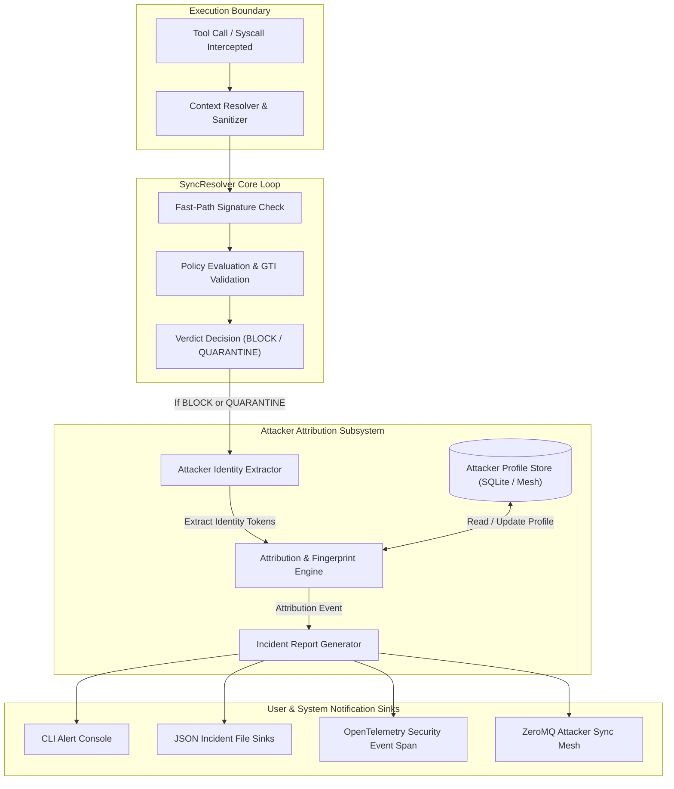

# System Architecture Design: Blackwall Attacker Identification & Reporting (`blackwall-attacker-attribution`)

## 1. Executive Summary & Product Vision

While Blackwall's primary runtime role is intercepting and mitigating rogue AI agent execution flows (returning `ALLOW`, `BLOCK`, or `QUARANTINE` verdicts), post-incident forensic analysis and immediate threat response require knowing **who** executed the attack, **how** they gained execution privileges, and **what** credentials or resources were targeted.

The **Attacker Identification & Reporting Subsystem** (`blackwall-attacker-attribution`) enriches Blackwall's core interception loop with end-to-end attacker attribution, threat lineage tracking, and automated incident reporting across both product tiers:

```
+---------------------------------------------------------------------------------------------------+
|                        BLACKWALL ATTACKER IDENTIFICATION & REPORTING                              |
+---------------------------------------------------+-----------------------------------------------+
|         BLACKWALL CORE (Individual Developer)     |        BLACKWALL ENTERPRISE MESH              |
+---------------------------------------------------+-----------------------------------------------+
| - Extraction of ADK Agent ID, thread_id, model    | - eBPF Linux process lineage & parent chain   |
| - Local process PID, UID, parent command line     | - Container sandbox ID & Kubernetes namespace |
| - Local SQLite threat graph attribution scoring   | - Cluster-wide ZeroMQ signature & ID sync     |
| - Standardized Markdown & JSON incident reports   | - OpenTelemetry security event trace linking  |
| - User alert callbacks & CLI output formatting    | - HashiCorp Vault token revocation triggers   |
+---------------------------------------------------+-----------------------------------------------+
```

---

## 2. Core Architecture & Interception Flow Integration

Attacker attribution is integrated directly into the `SyncResolver` and `ADKIntegration` resolution pipeline as an asynchronous, non-blocking post-verdict enrichment step.



---

## 3. Subsystem Components & Data Models

### 3.1 `AttackerIdentity` Model
Captures multi-layered caller identity attributes extracted during tool call interception.

```python
class IdentitySource(str, Enum):
    ADK_METADATA = "ADK_METADATA"
    SYSTEM_PROCESS = "SYSTEM_PROCESS"
    EBPF_KERNEL = "EBPF_KERNEL"
    CONTAINER = "CONTAINER"
    NETWORK_IP = "NETWORK_IP"
    VAULT_TOKEN = "VAULT_TOKEN"

class AttackerIdentity(BaseModel):
    identity_id: UUID = Field(default_factory=uuid4)
    agent_id: Optional[str] = None
    agent_name: Optional[str] = None
    agent_model: Optional[str] = None
    thread_id: Optional[str] = None
    process_pid: Optional[int] = None
    process_uid: Optional[int] = None
    process_name: Optional[str] = None
    process_cmdline: Optional[str] = None
    container_id: Optional[str] = None
    source_ip: Optional[str] = None
    vault_token_accessor: Optional[str] = None
    identity_fingerprint: str  # SHA-256 hash of primary identity attributes
    primary_source: IdentitySource
```

### 3.2 `AttackerProfile` Model
Tracks historical threat profiles and risk scores of recurring attacker identities across sessions.

```python
class AttackerProfile(BaseModel):
    fingerprint: str
    first_seen: datetime = Field(default_factory=lambda: datetime.now(timezone.utc))
    last_seen: datetime = Field(default_factory=lambda: datetime.now(timezone.utc))
    total_attacks: int = 1
    threat_score: float = Field(default=0.5, ge=0.0, le=1.0)
    associated_signatures: List[str] = Field(default_factory=list)
    targeted_tools: List[str] = Field(default_factory=list)
    risk_category: str = "HIGH"
```

### 3.3 `IncidentReport` Model
Standardized threat payload sent to reporting sinks.

```python
class IncidentReport(BaseModel):
    report_id: UUID = Field(default_factory=uuid4)
    timestamp: datetime = Field(default_factory=lambda: datetime.now(timezone.utc))
    event_id: UUID
    verdict: VerdictDecision
    attacker_identity: AttackerIdentity
    attacker_profile: AttackerProfile
    exploited_tool: str
    sanitized_arguments: Dict[str, Any]
    attack_technique: str
    mitigation_action: str
    recommended_user_action: str
    attribution_confidence: float = Field(..., ge=0.0, le=1.0)
```

---

## 4. Key Security & Design Constraints

1. **Non-Blocking Execution**: Attribution extraction and report generation must complete in under **< 5ms** and never block or delay the execution flow of benign requests.
2. **Fail-Closed Privacy Safeguard**: Attacker identity extraction must execute **after** `ContextResolver` sanitization to prevent sensitive environment variables or unredacted API tokens from leaking into identity fingerprints or incident reports.
3. **Graceful Degraded Mode**: If process lineage (eBPF) or ADK metadata is missing, `AttackerIdentityExtractor` falls back to extracting default thread/session tokens without throwing unhandled exceptions.
