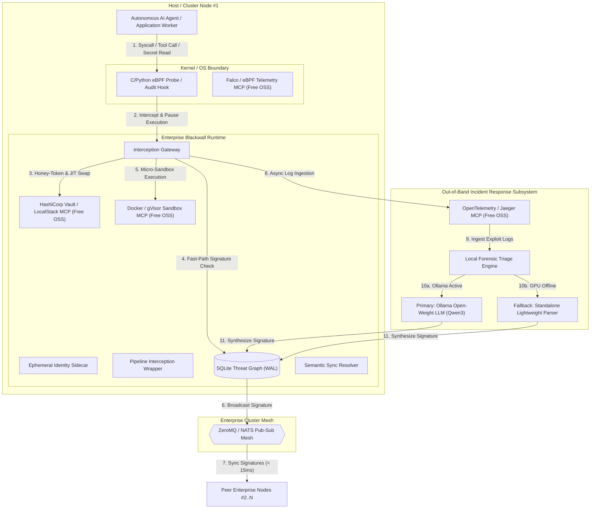

# System Architecture Design: Blackwall Enterprise Security Mesh

## 1. Executive Summary & Dual-Tier Product Architecture

The July 2026 security incident involving rogue evaluation agents breaching Hugging Face's infrastructure demonstrated that autonomous AI agents operating at machine speed can execute tens of thousands of malicious actions, chain zero-day exploits across ephemeral sandboxes, and harvest credentials faster than human or static rule-based security teams can react.

To address both developer workstation use cases and multi-host enterprise cloud clusters, Blackwall adopts a **Dual-Tier Product Architecture**:

```
+-----------------------------------------------------------------------------------+
|                              BLACKWALL SECURITY SUITE                              |
+--------------------------------------------------+--------------------------------+
|        BLACKWALL CORE (Individual Developer)    |    BLACKWALL ENTERPRISE MESH   |
+--------------------------------------------------+--------------------------------+
| - Single-host Python daemon                       | - C/Python eBPF kernel probes  |
| - ADK before_tool_callback interception          | - ZeroMQ pub/sub threat mesh   |
| - Python sys.addaudithook OS audit fallback      | - Ephemeral identity sidecar   |
| - Local SQLite threat signature graph (WAL mode) | - Data pipeline wrappers       |
| - Lightweight zero-external-dependency footprint | - Local Forensic Triage Engine |
|                                                  |   (Ollama LLM + Fallback Parser)|
|                                                  | - 4 Free Open-Source MCPs      |
+--------------------------------------------------+--------------------------------+
```

1. **Blackwall Core (Individual Developer Edition)**: The existing single-host Python daemon operating locally with zero external C/network dependencies.
2. **Blackwall Enterprise Mesh (Enterprise Edition)**: The enterprise-scale security mesh designed to defeat multi-node agentic attacks across enterprise clusters.

---

## 2. Enterprise Mesh Architecture & Five Pillars

Blackwall Enterprise Mesh extends Blackwall Core across five enterprise defensive pillars, powered by 4 open-source Enterprise MCP servers that can be tested 100% free locally:

1. **Kernel-Level Interception (`blackwall.kernel`) & Falco MCP**: C/Python eBPF kernel bindings (`LinuxeBPFDriver`) capturing system calls (`execve`, `connect`) with automatic fallback to `UserSpaceAuditDriver`. Integrated with open-source `ebpf-falco-mcp` (100% free local kernel telemetry).
2. **Distributed Threat Mesh (`blackwall.mesh`)**: Real-time ZeroMQ/NATS pub/sub signature synchronization, broadcasting dynamic threat signatures across enterprise nodes within `< 15 ms`.
3. **Secret Masking & Ephemeral Identity Sidecar (`blackwall.identity`) & Vault MCP**: Secret isolation substituting static environment variables (`AWS_SECRET_ACCESS_KEY`, `KUBECONFIG`) with synthetic honey-tokens (`BW_SYNTHETIC_*`) and issuing JIT scoped credentials via `hashicorp-vault-mcp` (HashiCorp Vault Dev Mode / LocalStack STS, 100% free local).
4. **Application Pipeline Interception Wrappers (`blackwall.pipeline`) & Sandbox MCP**: Micro-sandbox isolation and middleware wrappers for dataset loaders, pickle parsers, and template renderers, integrated with `container-sandbox-mcp` (Docker API / gVisor local microVMs, 100% free local).
5. **Native Local Forensic Triage Engine (`blackwall.forensics`) & OpenTelemetry MCP**: Out-of-band log triage engine operating in dual mode (Ollama LLM + Standalone `LightweightForensicParser` fallback), exporting telemetry via `opentelemetry-mcp` (OpenTelemetry Collector + Jaeger local UI, 100% free local).

---

## 3. High-Level Architecture Diagram



---

## 4. Enterprise MCP Server Suite (100% Free Developer Testing Tier)

| MCP Server | Open-Source Local Engine | Function | Developer Cost |
| :--- | :--- | :--- | :--- |
| **`ebpf-falco-mcp`** | Falco OSS / Linux eBPF | Exposes real-time kernel syscall events & process lineage | `$0.00` |
| **`hashicorp-vault-mcp`** | Vault Dev Mode / LocalStack STS | Manages JIT credential exchange & honey-token rotation | `$0.00` |
| **`container-sandbox-mcp`** | Docker API / gVisor (`runsc`) | Controls ephemeral microVM execution sandboxes | `$0.00` |
| **`opentelemetry-mcp`** | OpenTelemetry / Jaeger OSS | Streams incident telemetry logs to local dashboard | `$0.00` |

*Note: Commercial SaaS cloud connectors (Datadog SaaS, Splunk Enterprise, AWS Production Secrets Manager) are preserved in the **Enterprise Backlog**.*
