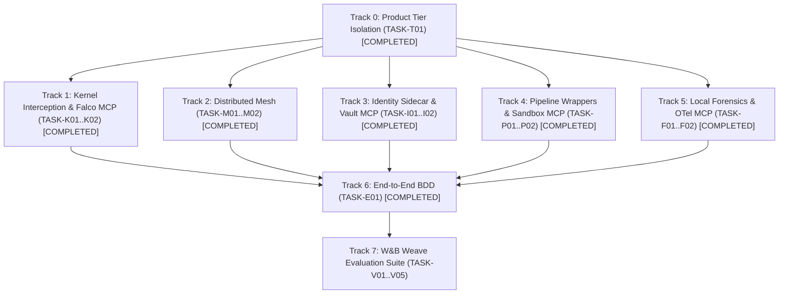

# Actionable Implementation Tasks: Blackwall Enterprise Security Mesh

This document details the test-driven implementation plan for **Blackwall Enterprise Security Mesh**. All tasks enforce strict Test-Driven Development (TDD) and Behavior-Driven Development (BDD) verification gates prior to completion.

---

## Task Track Matrix & Dependencies Overview

---

## Track 0: Product Tier Packaging & Isolation

### [x] TASK-T01: Core vs Enterprise Modular Packaging
- **Status**: Completed
- **Description**: Refactor `src/blackwall/` layout to ensure `Blackwall Core` remains a zero-dependency, single-host Python daemon while isolating enterprise capabilities under `src/blackwall/enterprise/`.
- **Traceability**: `FR-00`, `NFR-05`
- **Dependencies**: None
- **Verification Command**: `pytest -v tests/unit/test_tier_isolation.py`

---

## Track 1: Kernel-Level Interception Engine (`blackwall.enterprise.kernel`)

### [x] TASK-K01: Kernel Probe Interface & macOS Fallback Audit Driver
- **Status**: Completed
- **Description**: Implement `KernelProbeDriver` base interface and `UserSpaceAuditDriver` for macOS/Windows process monitoring using Python `sys.addaudithook`.
- **Traceability**: `FR-01`, `FR-02`
- **Dependencies**: `TASK-T01`
- **Verification Command**: `pytest -v tests/unit/test_kernel_probe.py`

### [x] TASK-K02: `ebpf-falco-mcp` Integration
- **Status**: Completed
- **Description**: Implement local open-source `ebpf-falco-mcp` adapter exposing kernel syscall events and process lineage.
- **Traceability**: `FR-16`, `NFR-03`
- **Dependencies**: `TASK-K01`
- **Verification Command**: `pytest -v tests/unit/test_falco_mcp.py`

---

## Track 2: Distributed Threat Mesh (`blackwall.enterprise.mesh`)

### [x] TASK-M01: ZeroMQ Pub/Sub Mesh Broadcaster
- **Status**: Completed
- **Description**: Build `MeshBroadcaster` service in `src/blackwall/enterprise/mesh/broadcaster.py` publishing signatures over ZeroMQ sockets.
- **Traceability**: `FR-04`, `NFR-02`
- **Dependencies**: `TASK-T01`
- **Verification Command**: `pytest -v tests/unit/test_mesh_broadcaster.py`

### [x] TASK-M02: Mesh Receiver & SQLite Ingestion Worker
- **Status**: Completed
- **Description**: Implement `MeshReceiver` service in `src/blackwall/enterprise/mesh/receiver.py` ingesting incoming mesh signatures into SQLite.
- **Traceability**: `FR-05`, `FR-06`, `NFR-01`, `NFR-02`
- **Dependencies**: `TASK-M01`
- **Verification Command**: `pytest -v tests/integration/test_mesh_sync.py`

---

## Track 3: Secret Masking & Ephemeral Identity Sidecar (`blackwall.enterprise.identity`)

### [x] TASK-I01: Environment Sterilization & Synthetic Honey-Tokens
- **Status**: Completed
- **Description**: Implement `SecretVaultSidecar` replacing real credentials with synthetic honey-tokens (`BW_SYNTHETIC_*`).
- **Traceability**: `FR-07`, `FR-08`
- **Dependencies**: `TASK-T01`
- **Verification Command**: `pytest -v tests/unit/test_identity_sidecar.py`

### [x] TASK-I02: `hashicorp-vault-mcp` Integration (Vault Dev Mode / LocalStack)
- **Status**: Completed
- **Description**: Build `hashicorp-vault-mcp` adapter providing JIT token exchange via local `vault server -dev` or LocalStack mock STS endpoints.
- **Traceability**: `FR-09`, `FR-17`, `NFR-03`
- **Dependencies**: `TASK-I01`
- **Verification Command**: `pytest -v tests/unit/test_vault_mcp.py`

---

## Track 4: Application Pipeline Interception Wrappers (`blackwall.enterprise.pipeline`)

### [x] TASK-P01: Micro-Sandbox Pipeline Decorator & AST Filter
- **Status**: Completed
- **Description**: Create `@blackwall.guard_pipeline` decorator and AST parser for isolating dataset loaders and template engines.
- **Traceability**: `FR-10`, `FR-11`
- **Dependencies**: `TASK-T01`
- **Verification Command**: `pytest -v tests/unit/test_pipeline_wrapper.py`

### [x] TASK-P02: `container-sandbox-mcp` Integration (Docker API / gVisor)
- **Status**: Completed
- **Description**: Implement `container-sandbox-mcp` adapter controlling local Docker container or gVisor (`runsc`) sandboxes.
- **Traceability**: `FR-18`, `NFR-03`
- **Dependencies**: `TASK-P01`
- **Verification Command**: `pytest -v tests/unit/test_sandbox_mcp.py`

---

## Track 5: Native Local Forensic Triage Engine (`blackwall.enterprise.forensics`)

### [x] TASK-F01: Primary Ollama Open-Weight LLM Triage Engine & `opentelemetry-mcp`
- **Status**: Completed
- **Description**: Implement `OllamaForensicEngine` streaming logs to local Ollama LLM endpoint and exporting incident traces via open-source `opentelemetry-mcp`.
- **Traceability**: `FR-12`, `FR-13`, `FR-16`
- **Dependencies**: `TASK-T01`
- **Verification Command**: `pytest -v tests/unit/test_ollama_forensics.py`

### [x] TASK-F02: Standalone Lightweight Fallback Parser
- **Status**: Completed
- **Description**: Implement `LightweightForensicParser` providing regex/AST heuristic signature extraction when Ollama/GPU is offline.
- **Traceability**: `FR-14`, `FR-15`, `NFR-04`
- **Dependencies**: `TASK-F01`
- **Verification Command**: `pytest -v tests/unit/test_forensic_fallback.py`

---

## Track 6: End-to-End Integration & BDD Verification

### [x] TASK-E01: Behavior-Driven Development (BDD) Feature Test Suite
- **Status**: Completed
- **Description**: Implement `tests/features/blackwall_enterprise_mesh.feature` and step definitions covering Core vs Enterprise tiers, 4 open-source MCP adapters, and forensic fallback.
- **Traceability**: `US-01`, `US-02`, `NFR-03`, `NFR-04`
- **Dependencies**: `TASK-T01`, `TASK-K02`, `TASK-M02`, `TASK-I02`, `TASK-P02`, `TASK-F02`
- **Verification Command**: `pytest -v tests/step_defs/test_enterprise_mesh.py`

---

## Track 7: W&B Weave Evaluation Suite (`tests/evals/`)

### TASK-V01: W&B Weave Track 1 Eval (Kernel Interception Accuracy)
- **Status**: Pending
- **Description**: Implement `eval_kernel_interception` evaluating system call interception accuracy across eBPF and Audit Hook drivers.
- **Verification Command**: `python -m pytest tests/evals/test_enterprise_weave_evals.py -k test_eval_kernel_interception`

### TASK-V02: W&B Weave Track 2 Eval (Threat Mesh Sync Latency)
- **Status**: Pending
- **Description**: Implement `eval_mesh_sync_latency` benchmarking multi-node signature broadcast and SQLite ingestion speed against the `< 15 ms` SLA.
- **Verification Command**: `python -m pytest tests/evals/test_enterprise_weave_evals.py -k test_eval_mesh_sync_latency`

### TASK-V03: W&B Weave Track 3 Eval (Honey-Token & Secret Vault Exchange)
- **Status**: Pending
- **Description**: Implement `eval_identity_honeytoken` evaluating synthetic credential exfiltration detection rate (100%) and JIT token swap accuracy.
- **Verification Command**: `python -m pytest tests/evals/test_enterprise_weave_evals.py -k test_eval_identity_honeytoken`

### TASK-V04: W&B Weave Track 4 Eval (Pipeline Micro-Sandbox Containment)
- **Status**: Pending
- **Description**: Implement `eval_pipeline_containment` evaluating dataset loader RCE and Jinja template injection neutralization score.
- **Verification Command**: `python -m pytest tests/evals/test_enterprise_weave_evals.py -k test_eval_pipeline_containment`

### TASK-V05: W&B Weave Track 5 Eval (Dual-Mode Local Forensic Triage)
- **Status**: Pending
- **Description**: Implement `eval_forensics_dual_mode` evaluating log triage accuracy across Primary Ollama LLM and Standalone Fallback modes with 0% safety refusal.
- **Verification Command**: `python -m pytest tests/evals/test_enterprise_weave_evals.py -k test_eval_forensics_dual_mode`
