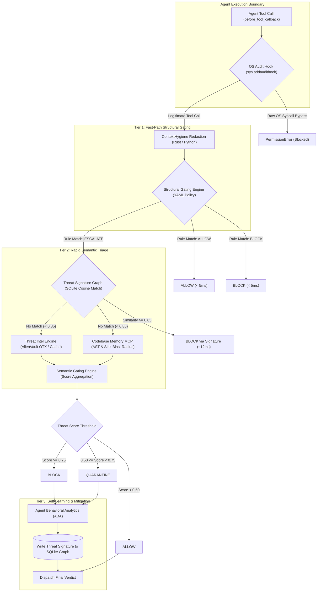
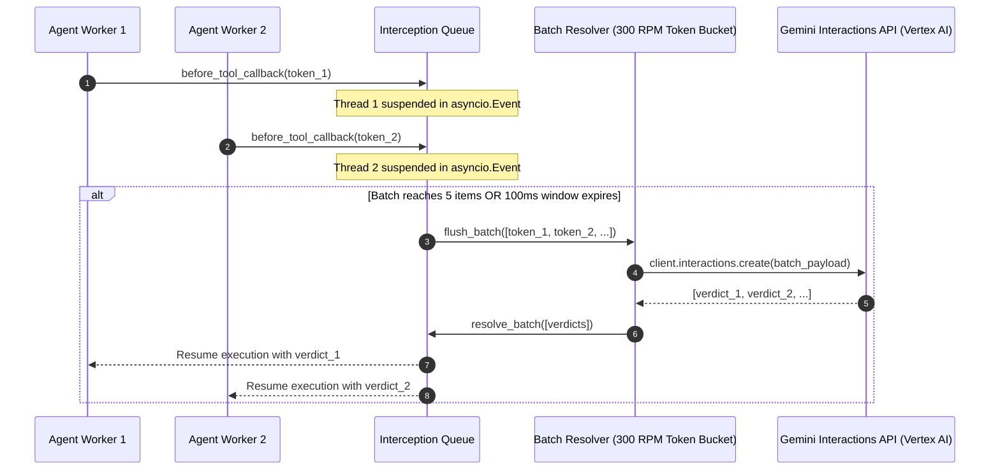
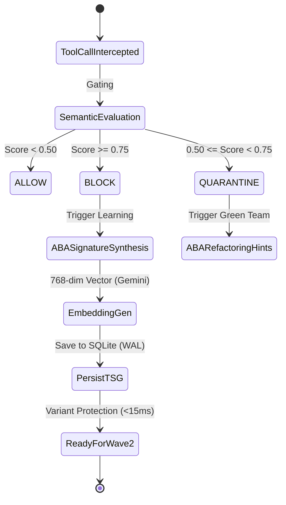

# Blackwall Core: Technical Architecture Deep-Dive

> **Specification Reference**: Governed by [.kiro/specs/blackwall-agentic-firewall/design.md](.kiro/specs/blackwall-agentic-firewall/design.md), fulfilling Requirements 28.3, 28.4, and 31.

---

## 1. Architectural Mission & Philosophy

Blackwall is an autonomous **Agentic Security Firewall** engineered to intercept execution flows at machine speed before rogue, hijacked, or misaligned AI agents can execute unauthorized OS actions, traverse networks, trigger zero-day exploits, or exfiltrate sensitive credentials.

Traditional perimeter firewalls, static web application firewalls (WAFs), and post-hoc audit logs fail to protect against autonomous agents for three fundamental reasons:
1. **Superhuman Velocity**: Malicious or hijacked agents can generate tens of thousands of novel, polymorphic payloads per minute—far faster than human security analysts or static allowlists can respond.
2. **Ambient Authority**: Processes running agents typically inherit the full OS privileges of the host user, enabling prompt injections to escalate directly to shell execution (`subprocess`, `os.system`) or raw network sockets.
3. **Semantic Ambiguity**: Malicious agent actions frequently mimic legitimate development tool use (e.g., modifying files, issuing shell scripts, downloading packages).

Blackwall solves these challenges through a **hybrid defense model**:
- **Zero Ambient Authority**: Enforced at the interpreter boundary via Python runtime audit hooks (`sys.addaudithook`) and compiled Rust extensions, compelling all actions to funnel through intercepted tool interfaces.
- **Dual-Layer Hybrid Gating**: Microsecond deterministic YAML structural policy checks combined with sub-100ms semantic LLM intent analysis powered by **100% GCP Vertex AI Mode** (Gemini Enterprise Agent Platform).
- **Asynchronous Batching**: Bridges the rate mismatch between 600 RPM attacker velocity and 300 RPM LLM API capacity.
- **Dynamic Self-Learning**: Auto-generates structural threat signatures from novel blocked attacks, turning a ~1,400ms semantic evaluation into a ~12ms local vector lookup for subsequent attack variants (a **118x speedup**).

---

## 2. Dual-Layer Evaluation Architecture

Blackwall evaluates tool calls through a tiered, fail-closed pipeline:



### 2.1 Tier 1: Structural Gating Engine (<5ms)
- **Policy Definition**: Configured via `config/policy.yaml` (and root `policy.yaml`), defining environment roles (`sandbox`, `development`, `staging`, `production`), permitted tools, and forbidden operations.
- **Rule Hierarchy**: Priority-ordered structural rules evaluating tool names, arguments, and caller environment roles using boolean logic.
- **Deterministic Outcomes**:
  - `ALLOW`: Instant pass-through for safe read-only operations (e.g., `read_file`, `list_dir` in `development`).
  - `BLOCK`: Immediate reject for dangerous execution tools (e.g., `execute_bash`, `run_python`, `install_package` in `production`).
  - `ESCALATE`: Routes sensitive operations (e.g., `write_file`, `http_request`, `database_query`) to Tier 2 for semantic analysis.
- **Zero API Overhead**: Evaluates purely in-process in `< 5ms` with hot-reload capabilities.
- **Debounced Hot-Reload Engine (`PolicyWatcher`)**: Watches policy YAML on disk using `watchdog` with 50ms timestamp-based debouncing and trailing retries. Prevents policy thrashing and ensures segmented/atomic file writes (e.g., temp-file creation, truncation, flush, and rename) do not drop subsequent completed writes. Supports context management via `with PolicyWatcher(...):` for clean lifecycle teardown.

### 2.2 Tier 2: Semantic Gating Engine (<100ms @ P99)
For escalated operations, Blackwall aggregates signals from three independent vectors:
$$\text{ThreatScore} = w_{\text{TI}} \cdot S_{\text{TI}} + w_{\text{CBM}} \cdot S_{\text{CBM}} + w_{\text{Context}} \cdot S_{\text{Context}}$$

- **Baseline Weights**:
  - $w_{\text{TI}} = 0.40$ (External threat intelligence for indicators of compromise via AlienVault OTX / Multi-Provider Orchestrator)
  - $w_{\text{CBM}} = 0.30$ (Abstract Syntax Tree dataflow and sink blast radius)
  - $w_{\text{Context}} = 0.30$ (Tool risk, parameter novelty, environment role)
- **Verdict Thresholds**:
  - $\text{ThreatScore} \ge 0.75 \implies \mathbf{BLOCK}$
  - $0.50 \le \text{ThreatScore} < 0.75 \implies \mathbf{QUARANTINE}$
  - $\text{ThreatScore} < 0.50 \implies \mathbf{ALLOW}$
- **Structured Output Schema Enforcement**: When delegating semantic intent analysis to Gemini 3.5 Flash-Lite, Blackwall enforces Pydantic schemas via `response_schema=Verdict` (or `list[Verdict]`) with `response_mime_type="application/json"`. The model directly outputs structured verdict instances, eliminating markdown fence parsing and regex recovery heuristics.
- **Thinking Level Routing**: Inline fast-path resolution operates with `thinking_level="minimal"` to satisfy the `<150ms` TTFT budget, while complex out-of-band forensics and behavioral analytics dynamically leverage `thinking_level="high"` or `None` on frontier reasoning models (e.g., Gemini 3.8 Flash).
- **Native Non-Blocking Async Calling (`client.aio`)**: Both `SyncResolver` and `BatchResolver` directly await native Google GenAI SDK `client.aio.models.generate_content` and `client.aio.interactions.create` coroutines. Eliminates thread-pool worker context switches, reduces memory overhead, and enforces the strict async non-blocking I/O standard across all high-throughput evaluation loops.

---

## 3. Asynchronous Batching & Interception Queue Management

A critical architectural challenge is the throughput mismatch: adversarial agents running parallel execution loops can generate **600+ requests per minute (RPM)**, while LLM provider quotas often enforce a **300 RPM ceiling**.

Blackwall bridges this gap using an asynchronous batching architecture:



### 3.1 Queue Mechanics
- **Callback Suspension**: When an agent invokes a tool, ADK's `before_tool_callback` is intercepted. A unique `CallbackToken` is generated, and the calling thread waits asynchronously on an internal `asyncio.Event`.
- **Sliding Accumulation Window**: The `InterceptionQueue` aggregates pending tokens up to a maximum batch size of **5 callbacks** or a flush timeout of **100ms** (whichever occurs first).
- **Emergency Flush**: If backpressure causes the queue depth to exceed 50 items, an emergency drain flushes immediately to prevent latency spikes.
- **Fail-Closed Guarantees**: If the queue experiences an unexpected shutdown or exhaustion, in-flight callbacks default strictly to `QUARANTINE` or `BLOCK`, never `ALLOW`.

### 3.2 Batch Resolver & Rate Limiting
- **Interactions API**: Uses the Gemini Interactions API (`client.interactions.create`) for multi-request evaluation with Gemini 3.5 Flash-Lite.
- **Structured Output Decoding**: Interception batches enforce typed output contracts via `response_schema=list[Verdict]` and `response_mime_type="application/json"`. The resolver deserializes model responses directly into typed `Verdict` objects.
- **Thinking Level Routing**: Batch requests dynamically specify `thinking_level="minimal"` during inline tool triage to prevent thinking token latency overhead.
- **Token Bucket Limiter**: Enforces a 300 RPM limit across a 60-second sliding window.
- **Context Caching**: Reuses server-side context via `previous_interaction_id`, reducing prompt token costs by over 50%.
- **Exponential Backoff**: When handling `APIRateLimitException`, requests back off dynamically at 100ms, 200ms, and 400ms before failing closed.

---

## 4. SQLite Threat Signature Graph (TSG)

The Threat Signature Graph provides local, persistent, sub-15ms threat recognition without recurring LLM latency.

### 4.1 Storage Architecture
The TSG is built on **SQLite in WAL (Write-Ahead Logging) mode** with dedicated connection pooling:
- `PRAGMA journal_mode = WAL;` (Enables concurrent non-blocking readers alongside a single writer)
- `PRAGMA synchronous = NORMAL;` (Maximizes write performance while maintaining durability)
- `PRAGMA busy_timeout = 5000;` (Prevents database lock contention under high concurrency)

### 4.2 Database Schema
```sql
CREATE TABLE threat_signatures (
    signature_id TEXT PRIMARY KEY,
    created_at TIMESTAMP NOT NULL,
    threat_level TEXT NOT NULL,          -- CRITICAL, HIGH, MEDIUM, LOW
    target_tool TEXT NOT NULL,
    payload_pattern TEXT NOT NULL,       -- Normalized regex / token string
    embedding_vector BLOB NOT NULL,      -- 768-dimensional float32 IEEE 754
    similarity_threshold REAL NOT NULL,  -- Default 0.85
    match_count INTEGER DEFAULT 0,
    last_matched_at TIMESTAMP,
    mitigation_action TEXT NOT NULL      -- BLOCK, QUARANTINE
);

CREATE VIRTUAL TABLE signature_fts USING fts5(
    signature_id UNINDEXED,
    payload_pattern,
    target_tool
);

CREATE TABLE security_events (
    event_id TEXT PRIMARY KEY,
    timestamp TIMESTAMP NOT NULL,
    agent_id TEXT NOT NULL,
    tool_name TEXT NOT NULL,
    raw_arguments TEXT,
    sanitized_arguments TEXT NOT NULL,
    threat_score REAL NOT NULL,
    verdict TEXT NOT NULL,
    signature_id TEXT REFERENCES threat_signatures(signature_id)
);
```

### 4.3 Two-Stage Fast Query Pattern
1. **Stage 1 (Token/FTS5 Filtering)**: Queries the SQLite FTS5 index for word-level intersection match quality:
   $$\text{match\_quality} = \frac{|\text{tokens}_{\text{payload}} \cap \text{tokens}_{\text{pattern}}|}{\min(|\text{tokens}_{\text{payload}}|, |\text{tokens}_{\text{pattern}}|)}$$
2. **Stage 2 (Vector Cosine Similarity)**: For candidates passing initial lexical thresholds, unpacks the 768-dimensional embedding vector and evaluates cosine similarity:
   $$\text{sim}(u, v) = \frac{u \cdot v}{\|u\|_2 \|v\|_2}$$
   If $\text{sim}(u, v) \ge \text{threshold}$, the action is instantly blocked in **~12ms**, updating `match_count` and bypassing all external network calls.

### 4.4 Eviction & Maintenance
- **TTL Eviction**: Signatures with zero matches within 30 days are pruned.
- **LFU Eviction**: When the signature graph approaches the maximum capacity of 10,000 entries, least-frequently-used signatures with low severity are evicted first.

---

## 5. Context Hygiene Middleware & Rust Acceleration

Untrusted agent payloads frequently contain sensitive environment credentials, passwords, or personal data that must never leak to external LLM providers or log sinks.

### 5.1 Redaction Pipeline
- **Middleware**: Intercepts `ToolCallContext` arguments before semantic gating.
- **Pattern Redaction**: Replaces sensitive data with generic placeholders:
  - AWS/GCP access keys $\to$ `[[API_KEY]]`
  - Passwords / Tokens $\to$ `[[PASSWORD]]`
  - Private IP addresses $\to$ `[[INTERNAL_IP]]`
  - File paths $\to$ `[[FILE_PATH]]`
- **Selective IOC Preservation Mode (`preserve_iocs=True`)**: When analyzing security events, Context Hygiene supports selective IOC preservation. Target filesystem attack surfaces (e.g., `/etc/shadow`, `/etc/passwd`, command binary paths) and network domain names are preserved un-redacted so the downstream LLM semantic gating engine can accurately evaluate threat context, while sensitive credentials (passwords, bearer tokens, API keys, private keys, and query parameter tokens) remain strictly redacted.
- **Idempotence**: Guaranteed $\text{sanitize}(\text{sanitize}(x)) = \text{sanitize}(x)$.
- **Non-Invertible Audit Trail**: Logs SHA-256 hashes of original values to preserve auditability without storing raw plaintext secrets.

### 5.2 Compiled Rust Acceleration Subsystem (`blackwall._core_rs`)

To ensure synchronous evaluation strictly obeys the $<5\text{ms}$ latency budget, latency-critical, CPU-bound hot paths are compiled into a native Rust extension (`crates/blackwall_core_rs/`) using **PyO3** and **Maturin**, governed by the **Non-Greedy Rewrite Philosophy (95% Python / 5% Rust)** (see [ADR 0005](docs/adr/0005-rust-native-acceleration-hotpaths.md) and [.kiro/specs/blackwall-rust-acceleration/](.kiro/specs/blackwall-rust-acceleration/)):

```
+---------------------------------------------------------------------------------------------------+
|                        BLACKWALL HYBRID RUNTIME TOPOLOGY (95% Python / 5% Rust)                   |
+---------------------------------------------------+-----------------------------------------------+
|         HIGH-LEVEL PYTHON ORCHESTRATION LAYER     |        NATIVE RUST EXTENSION (_core_rs)       |
+---------------------------------------------------+-----------------------------------------------+
| - Async Interception Resolvers (Sync / Batch)     | - DFA Regex Sanitization (O(N), No IPC)       |
| - SQLite Async Connection Pool & WAL persistence  | - SIMD 768-dim Vector Cosine Similarity       |
| - Google GenAI SDK (Vertex AI Mode) & GTI MCP     | - Word-Level Intersection Scoring (<5µs)      |
| - Pydantic Data Models & Semantic Routing Policy  | - Single-Pass RegexSet IOC & Entropy Engine   |
| - Cloud-Native Vertex AI Eval & OpenTelemetry     | - Graph DFS Path Traversal & Swarm Correlator |
+---------------------------------------------------+-----------------------------------------------+
```

#### The 4 Accelerated Hot-Path Subsystems:
1. **Context Sanitization Engine (`ContextSanitizer`)**:
   - Compiles sensitive token patterns into linear-time DFA regexes (guaranteed mathematically immune to ReDoS backtracking).
   - Supports **Middleware Mode** (`preserve_prefix=false`, replacing full matched tokens and logging SHA-256 original hashes) and **Resolver Mode** (`preserve_prefix=true`, preserving parameter names in prompts).
   - Latency SLA: $< 50\mu\text{s}$ on $\ge 9\text{KB}$ realistic payloads (measured $\approx 45\mu\text{s}$).
2. **Vector Math & Similarity Scoring Engine**:
   - Zero-copy byte buffer casting to `&[f32]` with auto-vectorized SIMD dot-product computation.
   - `batch_cosine_similarity`: Evaluates query vectors against an array of candidate vectors in a single FFI call with **corrupted candidate isolation** (malformed candidate rows in the database are quarantined with diagnostic logging while all valid candidates continue scoring).
   - `compute_word_intersection_match_quality`: Zero-allocation lowercase tokenization returning $\frac{|\text{query} \cap \text{cand}|}{\min(|\text{query}|, |\text{cand}|)}$ in $< 10\mu\text{s}$ (measured $\approx 5\mu\text{s}$).
3. **Single-Pass IOC Extraction & Shannon Entropy Engine**:
   - Single combined DFA pass via `RegexSet` detecting IPv4, IPv6, URLs, domains, and hashes.
   - Direct IP address validation via Rust `std::net::IpAddr`.
   - Single-pass 256-element byte frequency array computing Shannon entropy: $H(X) = -\sum p_i \log_2(p_i)$.
   - Latency SLA: $< 35\mu\text{s}$ combined on 1KB payloads (measured $\approx 20\mu\text{s}$).
4. **Graph DFS Traversal & Temporal Correlation Engine**:
   - Native recursive DFS path enumeration with cycle prevention and depth pruning ($\le 10,000$ limit) in `_core_rs.dfs_find_paths`.
   - Exponential decay edge weighting and pairwise two-pointer timestamp alignment (`_core_rs.avg_min_time_diff`).
   - Latency SLA: $< 500\mu\text{s}$ for 500 nodes with `max_paths=50` (measured $\approx 340\mu\text{s}$).

#### Zero-Panic FFI & Seamless Pure-Python Fallbacks:
- All PyO3 functions return `PyResult<T>` and never panic across the C ABI, mapping internal Rust errors directly to standard Python exceptions (`ValueError`, `RuntimeError`).
- All 7 Python wrappers (`context_hygiene.py`, `resolver.py`, `validators.py`, `repository.py`, `semantic.py`, `correlator.py`, `swarm.py`) provide seamless pure-Python fallbacks when the compiled binary is absent.
- Full verification suite:
  ```bash
  # Automated SLA benchmark suite verifying all 6 gates
  python scripts/benchmark_rust_hotpaths.py

  # Fallback invariant and parity suite
  pytest tests/unit/test_fallback_invariant.py -v
  ```

---

## 6. External Threat Intelligence & Context Integrations

### 6.1 AlienVault OTX Threat Intelligence Engine & Local Cache
- **High-Throughput Zero-Cost Baseline**: In-process asynchronous provider (`AlienVaultOTXProvider`) delivering **10,000 queries per hour (~166 RPM)** at **$0/month**, replacing the restrictive 4 RPM VirusTotal free-tier bottleneck.
- **Fast-Path SQLite Caching (`threat_intel_cache`)**: Persistent SQLite cache in WAL mode providing sub-millisecond response times ($< 1.0\text{ ms}$) for known indicators with a 24-hour TTL for benign entries and 6-hour TTL for malicious entries, auto-purged on database initialization.
- **3-State Circuit Breaker Resilience**: Proactively halts upstream queries on 5 consecutive failures (`OPEN`), testing connectivity in `HALF-OPEN` mode with a mandatory 3-probe success threshold before restoring to `CLOSED`. Any failure during `HALF-OPEN` immediately trips back to `OPEN`.
- **Fail-Safe Exception Propagation**: Provider failures raise explicit typed exceptions (`OTXCircuitBreakerOpenError`, `OTXTokenBucketExhaustedError`, `OTXLookupError`) rather than returning benign default responses, ensuring callers fall back cleanly to secondary feeds or local threat graph heuristics.
- **URL Credential Redaction**: All logged indicators pass through `_sanitize_indicator_for_log` to redact user-info credentials (`user:pass`) and query parameter secrets before persisting in log files.
- **Harpoon OSINT Companion Bridge**: Subprocess integration (`HarpoonBridge`) for deep interactive OSINT investigation via the `harpoon` CLI when installed.
- **Legacy VirusTotal Mode**: Retained as an opt-in fallback under `BW_THREAT_INTEL_BACKEND=virustotal` for organizations with existing commercial VirusTotal subscriptions.

### 6.2 Codebase Memory MCP
- **Abstract Syntax Tree (AST) Inspection**: Queries the active repository's AST graph to analyze the call chain leading to the intercepted tool call.
- **Critical Sink Detection**: Evaluates whether arguments flow into unsafe sinks:
  - SQL execution (`execute`, `cursor.execute`)
  - Shell command execution (`subprocess.Popen`, `system`)
  - File write operations (`open("w")`, `write`)
  - Network egress (`socket.connect`, `requests.post`)
- **Taint Flow & Blast Radius**: Calculates taint propagation and blast radius [0.0, 1.0] across dependent modules to inform the semantic threat score.

### 6.3 Zero-Disk-I/O Cached SSL Context Factory
- **Shared Transport Caching (`get_certifi_ssl_context`)**: Outbound Model Context Protocol (MCP) HTTP calls and external GTI queries route through a centralized SSLContext factory in `src/blackwall/mcp/transport.py`.
- **LRU Cache Singleton**: Backed by `@functools.lru_cache(maxsize=4)`, the factory initializes and caches the `certifi.where()` CA bundle once per process, reducing $O(N)$ filesystem reads and certificate parsing overhead to $O(1)$ on the hot interception path.

---

## 7. Agent Behavioral Analytics (ABA) & Self-Learning Pipeline



1. **Trigger Event**: Whenever a tool call receives a `BLOCK` verdict from Tier 2 semantic evaluation, `AgentBehavioralAnalytics.generate_signature()` is invoked.
2. **Payload Generalization**: Extracts invariant structural tokens from the malicious payload while stripping dynamic session parameters (e.g., ports, ephemeral timestamps, temporary process IDs).
3. **Structured Signature Synthesis**: Invokes Gemini with a typed schema (`ThreatSignaturePayload`), natively synthesizing pattern, threat level, mitigation action, and structured reasoning without regex or markdown repair heuristics.
4. **Vector Synthesis**: Calls the Gemini Embedding API (`text-embedding-004`) to generate a 768-dimensional normalized embedding vector.
5. **Graph Persistence**: Atomically writes the signature, payload regex, and vector to the SQLite `threat_signatures` table and broadcasts the event across OpenTelemetry.
6. **Adaptive Immunity**: When an attacker subsequently attempts a polymorphic variant of the same exploit, Tier 2 vector similarity matches the stored signature and blocks the attack locally in **~12ms**.

---

## 8. OpenTelemetry Distributed Tracing & Observability

Blackwall instruments every stage of the interception lifecycle using OpenTelemetry GenAI semantic conventions:
- **Trace Context Propagation**: Carries trace IDs across ADK callbacks, async queue suspension, batch resolution, and MCP tool execution.
- **Span Hierarchy**:
  - `blackwall.interception` (Root span for tool callback)
    - `blackwall.structural_gating` (YAML rule evaluation)
    - `blackwall.threat_signature_lookup` (SQLite cosine search)
    - `blackwall.batch_queue_wait` (Interception queue accumulation duration)
    - `blackwall.semantic_evaluation` (LLM inference + MCP calls)
      - `blackwall.gti_query` (VirusTotal IOC check)
      - `blackwall.cbm_query` (Codebase AST query)
    - `blackwall.signature_generation` (Self-learning loop)
- **Trace Attributes**: Emits `blackwall.verdict`, `blackwall.threat_score`, `blackwall.rule_id`, `blackwall.agent_id`, and `blackwall.tool_name`, as well as OpenTelemetry GenAI semantic conventions: `gen_ai.request.model`, `gen_ai.request.thinking_level`, and `gen_ai.usage.thought_tokens`.
- **Cloud Export**: Direct export to **Google Cloud Trace** and local Jaeger collectors via `opentelemetry-mcp`.

---

## 9. Security Invariants & Fail-Closed Guardrails

1. **Zero Ambient Authority**: Rogue agent processes never receive direct OS access. Python runtime audit hooks (`sys.addaudithook`) raise `PermissionError` on all unauthorized `os`, `subprocess`, `pty`, and `socket` attempts.
2. **Fail-Closed Principle**: Any unexpected exception (e.g., database lock, network timeout, Gemini API quota exhaustion) strictly results in a `BLOCK` or `QUARANTINE` verdict. Under no circumstances does a failure fail open to `ALLOW`.
3. **Least-Privilege Execution**: The Blackwall daemon drops root privileges and executes as an unprivileged service user.
4. **Token Hygiene & Credential Scrubbing**: Context hygiene is guaranteed to run before any telemetry export, remote API invocation, or database write.
5. **Hardened Local Vault & Cryptographic Key Derivation**: The local encrypted secrets store (`EncryptedLocalStore` / `LocalVault` in `src/blackwall/security/vault.py`) uses standard `HKDF-SHA256` key derivation (`cryptography.hazmat.primitives.kdf.hkdf.HKDF`) to resist dictionary and brute-force attacks on master keys. It enforces atomic file writes and restricted `0o600` file permissions (owner read/write only) via `os.open`, while maintaining automatic dual-cipher decryption fallback for legacy SHA-256 stores.
