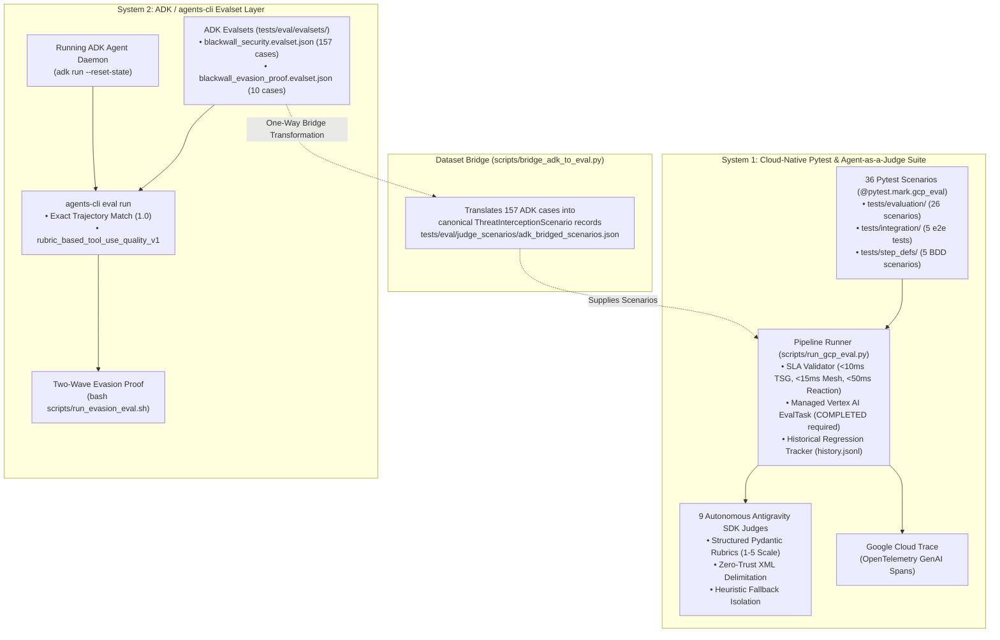

# Blackwall Evaluation Architecture & Operational Guide

## 1. Executive Summary & Dual Evaluation Architecture

Blackwall is an autonomous Agentic Security Firewall designed to intercept execution flows at machine speed before rogue AI agents can perform unauthorized actions. To validate both the single-host **Blackwall Core** developer edition and the multi-host **Blackwall Enterprise Mesh**, Blackwall employs **two complementary evaluation systems**:



---

## 2. Comparison Matrix

| Evaluation Dimension | **System 1: Cloud-Native Pytest & Agent-as-a-Judge** | **System 2: ADK / `agents-cli` Evalset Layer** |
| :--- | :--- | :--- |
| **Primary Focus** | Deep security policy evaluations across all 6 Enterprise pillars (Kernel, Mesh, Identity, Pipeline, Forensics, Swarm/ATD). | Blackwall Core ADK tool interception evaluation (`before_tool_callback`) across simulated conversational turns. |
| **Execution Tooling** | `pytest -v -m gcp_eval ...`<br>`python3 scripts/run_gcp_eval.py --eval-threshold 3.5` | `agents-cli eval run ...`<br>`bash scripts/run_evasion_eval.sh` |
| **Runtime Architecture** | In-process component workers + Vertex AI `EvalTask` + Cybench Cloud Run gVisor microVMs. | Running background ADK agent daemon (`adk run --reset-state`). |
| **Evaluation Engines** | 9 autonomous Google Antigravity SDK domain judges (`google.antigravity.Agent`) + Vertex AI `EvalTask`. | Google Agent Platform Eval Service via `agents-cli` (`EvalTask` autorater). |
| **Scenarios & Datasets** | `tests/eval/judge_scenarios/` + native GCP datasets (`blackwall.enterprise.advanced_threat_detection.gcp_eval_datasets`). | `tests/eval/evalsets/blackwall_security.evalset.json` (157 cases)<br>`tests/eval/evalsets/blackwall_evasion_proof.evalset.json` (10 cases). |
| **Key Metrics** | Domain-specific Pydantic rubrics (1–5 scale), SLA latencies (<10ms TSG, <5ms structural, <15ms mesh, <50ms reactions), historical regression deltas. | Exact trajectory match (`tool_trajectory_avg_score: 1.0`), `rubric_based_tool_use_quality_v1`, Evasion Rate, FRR. |
| **Telemetry & Observability** | OpenTelemetry spans with `gen_ai.evaluation.*` semantic conventions exported directly to Google Cloud Trace. | Timestamped JSON results in `artifacts/grade_results/` and HTML reports. |
| **CI Gating** | Deterministic exit code 0/1 based on configurable domain mean threshold ($\ge 3.5$) and regression check ($< 0.5$ drop). | Pass/fail based on exact trajectory matching and threshold pass rates. |

---

## 3. System 1: Cloud-Native Pytest & Agent-as-a-Judge Evaluation Suite

### Overview
System 1 is the primary evaluation and CI gating mechanism for the Blackwall Enterprise Security Mesh (governed by Tracks 7 and E of the technical specifications). It tests real kernel drivers, pub/sub threat meshes, ephemeral identity sidecars, container micro-sandboxes, local forensic engines, and multi-agent detection algorithms.

### Test Suites Included (36 Tests Total)
1. **Domain Scenarios (`tests/evaluation/`, 26 tests)**:
   - `test_tier1_adk_harness.py`: Kernel interception accuracy across eBPF/audit drivers (`TASK-V01`), ZeroMQ threat mesh sync latency within $< 15\text{ ms}$ (`TASK-V02`), synthetic honey-token exfiltration detection with 100% rate (`TASK-V03`), and dual-mode local forensic triage with 0% safety refusal (`TASK-V05`).
   - `test_tier2_gvisor_scenarios.py`: Multi-pillar containment lifecycle and pipeline micro-sandbox AST & gVisor container containment (`TASK-V04`).
   - Domain-specific scenarios: `test_c2_scenario.py`, `test_swarm_scenario.py`, `test_exploit_chain_scenario.py`, `test_k8s_scenario.py`, `test_ailm_scenario.py`, `test_context_hygiene_scenario.py`, `test_inbound_filter_scenario.py`, `test_prompt_injection_scenario.py`, `test_quota_enforcer_scenario.py`, `test_sync_resolver_scenario.py`, `test_callback_trajectory_scenario.py`.
2. **End-to-End Pipeline Integration (`tests/integration/test_eval_pipeline_e2e.py`, 5 tests)**:
   - Verifies the full pipeline lifecycle: scenario loading $\to$ security component candidate execution $\to$ judge evaluation $\to$ score aggregation $\to$ Cloud Trace telemetry $\to$ historical regression tracking.
3. **Behavior-Driven Specifications (`tests/features/eval_pipeline.feature` & `tests/step_defs/test_eval_pipeline_bdd.py`, 5 tests)**:
   - Gherkin behavioral contracts verifying passing gates, failing gates, outage fallback isolation, span attributes, and regression detection.

### Execution Commands

```bash
# 1. Run all 36 evaluation tests via pytest marker filter
pytest -v -m gcp_eval tests/evaluation/ tests/integration/test_eval_pipeline_e2e.py tests/step_defs/test_eval_pipeline_bdd.py

# 2. Run the automated Agent-as-a-Judge CI Pipeline Runner
python3 scripts/run_gcp_eval.py --eval-threshold 3.5

# 3. Scoped execution on specific evaluation domains
python3 scripts/run_gcp_eval.py --domains c2_detection,swarm_detection,exploit_chain

# 4. Air-gapped / Local workstation execution with fallback scoring
export BLACKWALL_DISABLE_CLOUD_TRACE=true
python3 scripts/run_gcp_eval.py --eval-threshold 3.5 --allow-fallback
```

---

## 4. System 2: ADK / `agents-cli` Evalset Layer

### Overview
System 2 evaluates Blackwall Core's tool interception proxy (`before_tool_callback`) using Google's official Agent Development Kit (ADK) evaluation tooling (`agents-cli`). It verifies that `before_tool_callback` fires before tool execution, returns proper verdicts (ALLOW, BLOCK, QUARANTINE), and that the self-learning threat signature loop detects structural variants 100x faster.

### Dataset Files
- **`tests/eval/evalsets/blackwall_security.evalset.json`**: 157 labelled test cases (59 malicious, 50+ benign, 20+ evasion variants).
- **`tests/eval/evalsets/blackwall_evasion_proof.evalset.json`**: 10-case two-wave evaluation proof:
  - *Wave 1*: 5 novel attacks requiring full semantic evaluation.
  - *Wave 2*: 5 structurally similar variants demonstrating instant TSG signature matching.
- **`tests/eval/eval_config.json`**: Configures exact trajectory matching (`tool_trajectory_avg_score: 1.0`) and LLM-as-a-judge rubric scoring (`rubric_based_tool_use_quality_v1`).

### Execution Commands

```bash
# 1. Automated Two-Wave Evasion Proof (Launches daemon and evaluates Wave 1 vs Wave 2)
bash scripts/run_evasion_eval.sh

# Under the hood, run_evasion_eval.sh delegates each wave to the live wave runner:
python3 scripts/run_evasion_wave.py --wave 1
python3 scripts/run_evasion_wave.py --wave 2

# 2. Direct agents-cli evaluation on the full security evalset
# Ensure the ADK agent is running: adk api_server agent/ --port 8080 &
agents-cli eval run tests/eval/evalsets/blackwall_security.evalset.json \
  --config tests/eval/eval_config.json \
  --print_detailed_results
```

---

## 5. The Dataset Bridge (`scripts/bridge_adk_to_eval.py`)

The dataset bridge bridges the two evaluation worlds. It transforms the 157 ADK conversational test cases from `tests/eval/evalsets/blackwall_security.evalset.json` into canonical `ThreatInterceptionScenario` records:

```bash
# Execute the bridge to regenerate adk_bridged_scenarios.json
python3 scripts/bridge_adk_to_eval.py
```

**Mapping Applied by the Bridge:**
- `eval_case_id` $\to$ `scenario_id`
- `conversation[0].parts[0].text` $\to$ `prompt`
- `reference.response.parts[0].text` $\to$ `ground_truth_verdict` (ALLOW, BLOCK, QUARANTINE)
- `metadata.ground_truth` $\to$ `ground_truth_label` (BENIGN, MALICIOUS)
- `expected_tool_use[].tool_name` $\to$ `reference_trajectory`

Once bridged to `tests/eval/judge_scenarios/adk_bridged_scenarios.json`, the scenarios are automatically consumed by `scripts/run_gcp_eval.py` in System 1.

---

## 6. Environment Configuration & Quota Requirements

Both evaluation systems strictly require **100% GCP Vertex AI Mode** under Application Default Credentials (ADC). Third-party SaaS tokens (`WANDB_API_KEY`) and Google AI Studio keys (`GEMINI_API_KEY`) are permanently prohibited.

```ini
# GCP Application Default Credentials & Project
GCP_PROJECT=your-gcp-project-id
GCP_LOCATION=us-central1
GOOGLE_GENAI_USE_VERTEXAI=true

# Mandatory Paid Tier Quota Contract (300+ RPM via Gemini Enterprise Agent Platform)
GEMINI_TIER=paid
BLACKWALL_TIER=paid

# Telemetry
BLACKWALL_DISABLE_CLOUD_TRACE=false
BLACKWALL_EXPORT_CLOUD_TRACE=true
```

For detailed CI/CD pipeline stage integration and Workload Identity Federation (WIF) setup, refer to [`docs/ci_evaluation_stage_template.md`](ci_evaluation_stage_template.md).

---

## 7. Tier-1 Jev Triage Evaluation & Analytics Dashboard

The Tier-1 Jev classifier (`typesafe-ai/jev`, governed by `.kiro/specs/tier-1-jev-addition/`) is evaluated separately from the Vertex-judged suites above, then inspected in the Marimo dashboard.

### Running the triage eval

```bash
# Paid Vercel AI Gateway credits recommended (free tier is rate-capped).
# Every call sets disallowPromptTraining; states are ContextHygiene-sanitized.
AI_GATEWAY_API_KEY=... .venv/bin/python scripts/jev_triage_eval.py
# Options: --limit N (subset), --suites security evasion_proof, --pace-ms 2000
```

This writes `tests/eval/results/jev_triage_results.json` — one record per case (`eval_case_id`, `p_threat`, `backend`, `latency_ms`, token usage). Runs checkpoint and resume safely; re-running after fixture changes re-evaluates only changed cases (resume is keyed on content hash).

### Inspecting results

```bash
.venv/bin/python -m marimo edit notebooks/benchmark_analytics.py
```

The **Tier-1 Classifier Analytics** section shows gate stats (accuracy ≥98%, AUROC ≥0.95, ECE ≤0.10, escalation ≤25%), plotly confusion matrix / ROC / reliability / separation views, per-case `P(threat)` with band zones, and an Explainable-AI panel (exact span ablation plus opt-in sampled Shapley, both button-gated live calls). Acceptance is computed at the fixed `0.35/0.75` band; sliders are exploratory only. With no artifact present the section renders an empty state — never placeholder data.
